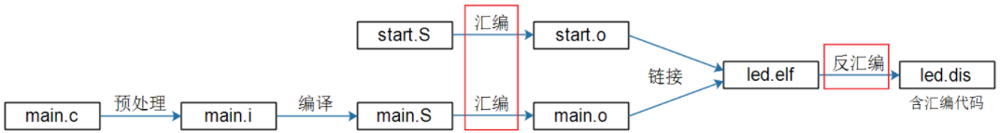

# gcc

### 编译过程

> 一个C/C++文件要经过**预处理**(preprocessing)、**编译**(compilation)、**汇编**(assembly)和**链接**(linking)等4步才能变成可执行文件。
>
> 
>
> ```bash
> gcc hello.c			#输出一个a.out的可执行程序； 执行 ./a.out
> gcc -E hello.c -o hello.i 	#预处理并输出一个hello.i文件
> gcc -S hello.i -o hello.s 	#编译并输出一个hello.s文件
> gcc -c hello.s -o hello.o 	#汇编并输出一个hello.o文件
> gcc hello.o -o hello 	    #输出一个可执行程序
> ```

### 案例一：跨文件编译 .h .c 文件

> **目录结构**
>
> ```
> .
> ├── include
> │   ├── hello.c
> │   └── hello.h
> ├── main.c
> └── obj
> ```
>
> *hello.h*
>
> ```c
> #ifndef _HELLO_H
> #define _HELLO_H
> 
> void HelloPrintf();
> 
> #endif
> ```
>
> *hello.c*
>
> ```c
> #include <stdio.h>
> #include "hello.h"
> 
> void HelloPrintf(){
> 	printf("Hello Linux!\n");
> }
> ```
>
> *main.c*
>
> ```c
> #include <stdio.h>
> #include "hello.h"
> 
> int main(){
> 	HelloPrintf();
> 	printf("Hello Arm!\n");
> 	return 0;
> }
> ```
>
> *执行命令*
>
> ```bash
> gcc -c ./include/hello.c -o ./include/hello.o && gcc main.c ./include/hello.o -o ./obj/main -I ./include/
> ```
>
> *解析*
>
> ```bash
> gcc -c ./include/hello.c -o ./include/hello.o #将./inclued/hello.c 编译并输出为.o文件到其目录下
> gcc main.c ./include/hello.o -o ./obj/main -I ./include/ #将main.c和include下的.o文件链接到obj目录下，-I 指定头文件目录
> # && 表示：cmd0 && cmd1  只有在cmd0执行完成后才执行cmd1
> ```
>
> *上面的命令也可简写如下：*
>
> ```bash
> gcc main.c ./include/hello.c -o ./obj/main -I ./include/
> ```
>
> *Makefile*
>
> ```makefile
> main : main.c ./include/hello.c
> 	gcc main.c ./include/hello.c -o ./obj/main -I ./include/
> clean:
> 	rm ./obj/main ./obj/*.o -f
> .PHONY: clean
> ```

