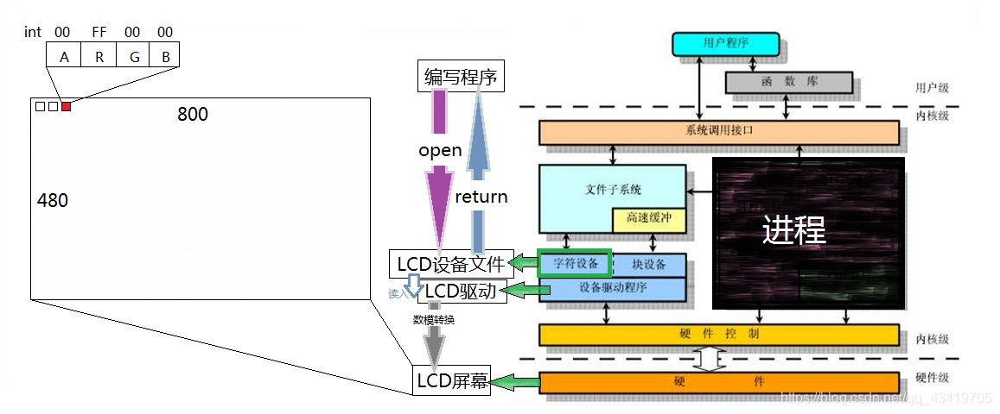

# FrameBuffer

FrameBuffer 是 Linux 系统中的一种显示驱动接口。FrameBuffer 将显示硬件进行抽象，对用户表现为一块显示内存，用户空间进程可以直接操作这块内存空间完成写屏操作。FrameBuffer 在设备上表现为一个字符设备，设备节点为 `/dev/fb*`。用户对设备节点进程 open、mmap、ioctl、read、write 等操作，就可以控制最终的显示输出。




*驱动文件目录*

```bash
/dev/fb0
```

**案例一：LCD显示红色**

```c
#include <stdio.h>
/* open */
#include <sys/types.h>
#include <sys/stat.h>
#include <fcntl.h>
/* write close */
#include <unistd.h>

int main(){
	int colorbuf[400 * 240] = {0}; //设置颜色缓冲区，大小更加LCD屏分辨率而定
	int LCD_fd;
	
	//打开lcd
	LCD_fd = open("/dev/fb0", O_RDWR);
	if(LCD_fd == -1)
	{
		/* perror("打开lcd错误，原因是"); */
		printf("ERROR, can not open LCD.");
		return -1;
	}
	
	//准备颜色数据
	for(int i=0; i<400 * 240; i++){
		colorbuf[i] = 0xFF0000;	//全部设置为红色
	}
	write(LCD_fd, colorbuf, 400 * 240 * 4);	//参数3为内容长度（字节数），因为400*240为int型长度为4个字节
	
	return 0;
}
```

**案例二：优化案例一（内存映射）**

```c
#include <stdio.h>
/* open */
#include <sys/types.h>
#include <sys/stat.h>
#include <fcntl.h>
/* write close */
#include <unistd.h>
/* memcpy */	
#include <string.h>
/* mmap */
#include <sys/mman.h>

int main()
{
	int colorbuf[400*240] = {0};
	int LCD_fd;
	int *LCD_memory;
	
	LCD_fd = open("/dev/fb0",O_RDWR);
	if(LCD_fd == -1){
		printf("ERROR! Can not open LCD.");
		return -1;
	}
	
	LCD_memory = mmap(NULL,   				//映射空间的首地址， 如果写NULL 表示由系统自动分配空间
						400*242*4, 				//要映射的空间的大小
						PROT_READ|PROT_WRITE,	 //权限可读可写
						MAP_SHARED,				//映射空间的作用为共享内存
						LCD_fd,					//有效的文件描述符（入口）
						0);						//偏移量
						
	//颜色数据
	for (int i = 0; i < 400*242; i++){
		colorbuf[i] = 0xFF0000;	
	}
	
	//直接将数据拷贝放入,避免慢慢写入造成的图像卡顿
	memcpy(LCD_memory, colorbuf, 400*242*4);	//将colorbuf所指向的内复制到LCD_memory，参数三为长度，字节数
	
	//释放内存
	munmap(LCD_memory, 400*242*4);
	
	//关闭LCD
	close(LCD_fd);

	return 0;
}
```

**案例三：LCD上显示三原色**

```c
/*********在LCD屏幕上从上到下显示RGB三种颜色***********/
#include <stdio.h>
#include <sys/types.h>
#include <sys/stat.h>
#include <fcntl.h>
#include <unistd.h>
#include <sys/mman.h>
#include <string.h>

int main()
{
	int LCD_fd;
	int LCD_buf[400*360] = {0};
	int LCD_Colors[3] = {0xFF0000,0x00FF00,0x0000FF};	//红绿蓝
	int *LCD_memory;
	
	//定义颜色
	for (int i = 0; i < sizeof(LCD_buf)/4; i++){
		if(i<=48000){
			LCD_buf[i] = LCD_Colors[0];
		}else if(i<=2*48000){
			LCD_buf[i] = LCD_Colors[1];
		}else{
			LCD_buf[i] = LCD_Colors[2];
		}
	}
	
	//打开FrameBuffer驱动文件
	LCD_fd = open("/dev/fb0", O_RDWR);	
	
	//将FrameBuffer驱动文件内存映射到LCD_memory
	LCD_memory = mmap(NULL, sizeof(LCD_buf), PROT_READ | PROT_WRITE, MAP_SHARED, LCD_fd, 0); 
	
	//将LCD_buf内存复制给LCD_memory --> /dev/fb0
	memcpy(LCD_memory, LCD_buf, sizeof(LCD_buf));
	
	//释放内存
	munmap(LCD_memory, sizeof(LCD_buf));
	
	//关闭文件
	close(LCD_fd);

	return 0;
}

```

### 字符设备驱动

案例四：ASCII字符的点阵显示

​		要在LCD中显示一个ASCII字符，即英文字母这些字符，首先是要找到字符对应的点阵。在Linux内核源码中有这个文件：lib\fonts\font_8x16.c，里面以数组形式保存各个字符的点阵，比如：


代码

```C
#include <sys/mman.h>
#include <sys/types.h>
#include <sys/stat.h>
#include <unistd.h>
#include <linux/fb.h>
#include <fcntl.h>
#include <stdio.h>
#include <string.h>
#include <sys/ioctl.h>

#define FONTDATAMAX 4096

static const unsigned char fontdata_8x16[FONTDATAMAX] = {
	/* 1 0x01 '^A' */
	0x00, /* 00000000 */
	0x00, /* 00000000 */
	0x7e, /* 01111110 */
	0x81, /* 10000001 */
	0xa5, /* 10100101 */
	0x81, /* 10000001 */
	0x81, /* 10000001 */
	0xbd, /* 10111101 */
	0x99, /* 10011001 */
	0x81, /* 10000001 */
	0x81, /* 10000001 */
	0x7e, /* 01111110 */
	0x00, /* 00000000 */
	0x00, /* 00000000 */
	0x00, /* 00000000 */
	0x00, /* 00000000 */
};

void LCD_Put_Pixel(int x, int y, unsigned int color);

/**********************************************************************
 * 函数名称： LCD_Put_ASCII
 * 功能描述： 在LCD指定位置上显示一个8*16的字符
 * 输入参数： x坐标，y坐标，ascii码
 * 输出参数： 无
 * 返 回 值： 无
 * 修改日期        版本号     修改人	      修改内容
 * -----------------------------------------------
 * 2022/05/12	   V1.0	    Zanerogl	     创建
 ***********************************************************************/ 

void LCD_Put_ASCII(int x, int y, unsigned char c);	


/*变量*/
int LCD_fb;
struct fb_var_screeninfo var;
static unsigned int pixel_width;
static unsigned int Line_width;
int LCD_screen_size;
unsigned char *LCD_fb_memory;

int main(int argc, char **argv){
	LCD_fb = open("/dev/fb0", O_RDWR);
	if (LCD_fb < 0){
		printf("Can not open /dev/fb0\n");
		return -1;
	}
	if (ioctl(LCD_fb, FBIOGET_VSCREENINFO, &var)){
		printf("Can not get var\n");
		return -1;
	}
	
	pixel_width = var.bits_per_pixel / 8;
	LCD_screen_size = var.xres * var.yres * var.bits_per_pixel / 8;
	Line_width = var.xres * var.bits_per_pixel / 8;
	
	LCD_fb_memory = mmap(NULL, LCD_screen_size, PROT_READ | PROT_WRITE, MAP_SHARED, LCD_fb, 0);
	if(LCD_fb_memory == (unsigned char *)-1){
		printf("Can not mmap\n");
		return -1;
	}
	
	//清屏，全设为黑色
	memset(LCD_fb_memory, 0, LCD_screen_size);
	
	LCD_Put_ASCII(var.xres/2, var.yres/2, 'C');	/*在屏幕中间显示字母A*/
	
	return 0;
}

void LCD_Put_Pixel(int x, int y, unsigned int color){
	unsigned char *pen_8 = LCD_fb_memory + y * Line_width + x * pixel_width;
	unsigned short *pen_16;
	unsigned int *pen_32;
	
	unsigned int red, green, blue;
	
	pen_16 = (unsigned short *)pen_8;
	pen_32 = (unsigned int *)pen_8;
	
	switch(var.bits_per_pixel)
	{
		case 8:
		{
			*pen_8 = color;
			break;
		}
		case 16:
		{
			/*565*/
			red   = (color >> 16) & 0xff;
			green = (color >> 8) & 0xff;
			blue  = (color >> 0) & 0xff;
			color = ((red >> 3) << 11) | ((green >> 2) << 5) | (blue >> 3);
			*pen_16 = color;
			break;
		}
		case 32:
		{
			*pen_32 = color;
			break;
		}
		default:
		{
			printf("can't surport %dbpp\n", var.bits_per_pixel);
			break;
		}
	}
}

void LCD_Put_ASCII(int x, int y, unsigned char c){	//此处的xy其实对应着ASCII码点阵数据的右上角的那个坐标[0][0]
	unsigned char *dots = (unsigned char *) & fontdata_8x16 [ c * 16 ];	//将ASCII码C对应的点阵地址赋值给*dots
	unsigned char byte;
	
	for(int i = 0; i < 16; i++){	//16行
		byte = dots[i];
		for(int j = 7; j >= 0; j--){	//8列
			if(byte & (1<<j)){				//高啊！！！
				LCD_Put_Pixel( x+7-j, y+i, 0xffffff);	//白
			}else{
				/* hide */
				LCD_Put_Pixel(x+7-j, y+i, 0); 	//黑
			}
		}
	}
}
```

