#  STM32

## 简介

- STM32系列是由意法半导体公司推出的ARM Cortex-M内核单片机，从字面上来看，ST为意法半导体公司的缩写，M是Microcontrollers即单片机的缩写，32代表32位

-----

### 芯片系列

- 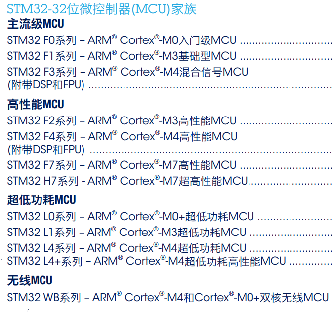
- 

----

### 命名规则

- 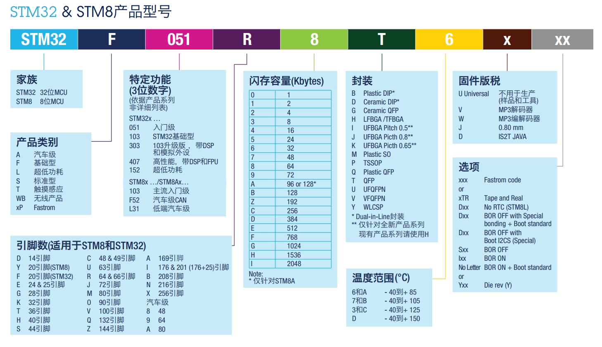

-----

### 使用的芯片

***STM32F103C8T6***

- 系列：主流系列STM32 F1
- 内核：ARM Cortex-M3
- 主频：72 MHz
- RAM（随机存取存储器，运行内存）：20 K (SRAM)
- ROM（程序存储器）：64 K (Flash)
- 供电：2.0-3.6V(标准3.3V)
- 封装：LQFP48 （指的是芯片有48个引脚）

----

### 外设资源

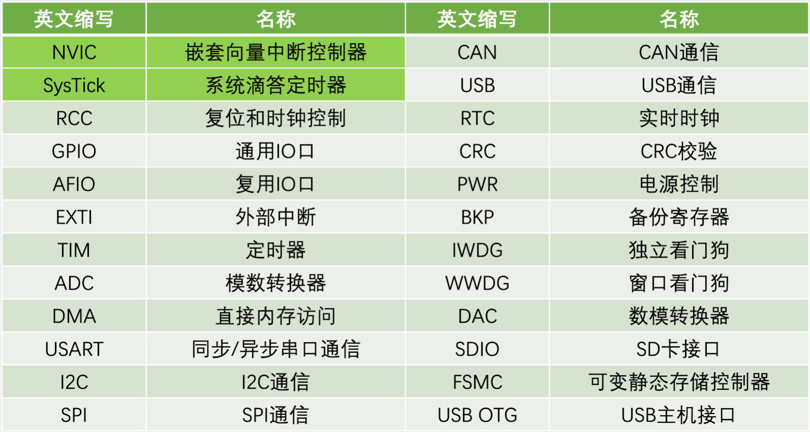

- **NVIC** 

  > 嵌套向量中断控制器，内核里用于管理中断的设备
  >
  > 比如：中断优先级

- **SysTick**

  >系统滴答定时器，主要用于给操作系统提供定时服务

- **RCC**

  > 配置系统时钟，使能各模块的时钟
  >
  > 与51不同，STM32为了降低功耗时钟都是默认disable的
  >
  > 时钟的功能就好像是一个小开关，你要用什么寄存器就先对应的打开开关，即：使能对应的时钟。

- **GPIO**

  >通用型之输入输出的简称

- **AFIO**

  > AFIO就是IO复用，就是一个IO口用在多个外设上
  >
  > 这样做的目的是节省IO资源，提高IO利用率

- **EXTI**

  > 外部中断/事件控制器管理了控制器的 20个中断/事件线
  >
  > 每个中断/事件线都对应有一个边沿检测器，可以实现输入信号的上升沿检测和下降沿的检测。 
  >
  > EXTI 可以实现对每个中断/事件线进行单独配置，可以单独配置为中断或者事件，以及触发事件的属性。
  >
  > 当引脚有电平变化时，触发中断，让CPU来处理任务
  >
  > **中断响应/事件响应：**前者触发中断，后者触发外设（即外设之间的互联）

- **TIM**

  > 高级定时器
  >
  > 通用定时器
  >
  > 基本定时器

- **ADC**

  > 通常是指一个将模拟信号转变为数字信号的电子元件

----

### 启动配置

- 

----

## GPIO


- **GPIO操作步骤**               **重要   !!!!!**

  > 1. 使用RCC开启GPIO的时钟
  > 2. 使用GPIO_Init函数初始化GPIO
  > 3. 使用输出或者输入控制GPIO口

----

### 工作模式

```c
typedef enum
{ GPIO_Mode_AIN = 0x0,			//模拟输入
  GPIO_Mode_IN_FLOATING = 0x04,	 //浮空输入
  GPIO_Mode_IPD = 0x28,			//下拉输入
  GPIO_Mode_IPU = 0x48,			//上拉输入
  GPIO_Mode_Out_OD = 0x14,		//开漏输出
  GPIO_Mode_Out_PP = 0x10,		//推挽输出，该模式下高低电平均有驱动能力
  GPIO_Mode_AF_OD = 0x1C,		//复用开漏
  GPIO_Mode_AF_PP = 0x18		//复用推挽
}GPIOMode_TypeDef;
```

*对应普通的开漏 / 推挽输出引脚的控制权来自于**输出数据寄存器**，要让定时器控制GPIO引脚则需要用 复用开漏 / 复用推挽输出*

-----

### LED灯闪烁

**库函数：RCC_APB2PeriphClockCmd()**

```C
RCC_APB2PeriphClockCmd( RCC_APB2Periph_GPIOA, ENABLE );
```

**功能**

- 使能外设时钟

**原型**

```c++
void RCC_APB2PeriphClockCmd（uint32_t RCC_APB2Periph, FunctionalState NewState）
```

**参数**

1. 选外设端口。例如，用PA0口，则选用RCC_APB2Periph_GPIOA；用PB0口，则选用RCC_APB2Periph_GPIOB；
2. 选enable or disable。

**代码**

```c
#include "stm32f10x.h"                  // Device header
#include "Delay.h"

int main(void){
	//使能外设时钟
	RCC_APB2PeriphClockCmd(RCC_APB2Periph_GPIOA, ENABLE);
	
	//配置GPIO初始化所需要用的一些信息
	GPIO_InitTypeDef GPIO_InitStructure;
	GPIO_InitStructure.GPIO_Mode = GPIO_Mode_Out_PP;	//工作模式为推挽输出，该模式下高低电平均有驱动能力
	GPIO_InitStructure.GPIO_Pin = GPIO_Pin_0;			//用的是GPIO外设的0号引脚
	GPIO_InitStructure.GPIO_Speed = GPIO_Speed_50MHz;	//输出速度为50MHz
	
	//初始化GPIO
	GPIO_Init(GPIOA, &GPIO_InitStructure);
	
	//拉低PA0号引脚输出电平
//	GPIO_ResetBits(GPIOA, GPIO_Pin_0);	//点灯
	//拉高PA0号引脚输出电平
//	GPIO_SetBits(GPIOA, GPIO_Pin_0);	//熄灭
	
	while(1)
	{
		//对指定端口的电平拉高或者拉低，可以操作多个端口，实现效果和GPIO_ResetBits/GPIO_SetBits一样
		GPIO_WriteBit(GPIOA, GPIO_Pin_0, Bit_RESET);	//点灯
		Delay_ms(500);
		GPIO_WriteBit(GPIOA, GPIO_Pin_0, Bit_SET);		//熄灭
		Delay_ms(500);
		/*
		//也可以这样写：
		GPIO_WriteBit(GPIOA, GPIO_Pin_0, 0);			//报错或警告就将0改为:(BitAction)0
		GPIO_WriteBit(GPIOA, GPIO_Pin_0, (BitAction)1);	//强制类型转换
		*/
	}
}
//最后一行要留多加一个空行

```

-----

### LED流水灯

**代码**

```c
#include "stm32f10x.h"                  // Device header
#include "Delay.h"

int main(void){
	//使能外设时钟
	RCC_APB2PeriphClockCmd(RCC_APB2Periph_GPIOA, ENABLE);
	
	//配置GPIO初始化所需要用的一些信息
	GPIO_InitTypeDef GPIO_InitStructure;
	GPIO_InitStructure.GPIO_Mode = GPIO_Mode_Out_PP;	//工作模式为推挽输出，该模式下高低电平均有驱动能力
    GPIO_InitStructure.GPIO_Pin = GPIO_Pin_All;			//初始化0~15个端口
	GPIO_InitStructure.GPIO_Speed = GPIO_Speed_50MHz;	//输出速度为50MHz
	
	//初始化GPIO
	GPIO_Init(GPIOA, &GPIO_InitStructure);
	
	while(1)
	{
        // 通过内存地址的方式修改电平，0x0001是十六进制码，前面加~是因为低电平点亮，所以要取反
        GPIO_Write(GPIOA, ~0x0001);		//0000 0000 0000 0001	1	对应的引脚地址
        Delay_ms(100);
        GPIO_Write(GPIOA, ~0x0002);		//0000 0000 0000 0010	2
        Delay_ms(100);
        GPIO_Write(GPIOA, ~0x0004);		//0000 0000 0000 0100	4
        Delay_ms(100);
        GPIO_Write(GPIOA, ~0x0008);		//0000 0000 0000 1000	8
        Delay_ms(100);
        GPIO_Write(GPIOA, ~0x00010);	//0000 0000 0001 0000	16
        Delay_ms(100);
        GPIO_Write(GPIOA, ~0x00020);	//0000 0000 0010 0000	32
        Delay_ms(100);
        GPIO_Write(GPIOA, ~0x00040);	//0000 0000 0100 0000	64
        Delay_ms(100);
        GPIO_Write(GPIOA, ~0x00080);	//0000 0000 1000 0000	128
        Delay_ms(100);
	}
}
//最后一行要留多加一个空行

```

*补充：初始化多个引脚口时可以通过异或来初始化*

```c
GPIO_InitStructure.GPIO_Pin = GPIO_Pin_0 | GPIO_Pin_1 | GPIO_Pin_2;
```

*使用 for() 优化后*

**代码**

```c
#include "stm32f10x.h"                  // Device header
#include "Delay.h"
#include <math.h>

int main(void){
	//使能外设时钟
	RCC_APB2PeriphClockCmd(RCC_APB2Periph_GPIOA, ENABLE);
	
	//配置GPIO初始化所需要用的一些信息
	GPIO_InitTypeDef GPIO_InitStructure;
	GPIO_InitStructure.GPIO_Mode = GPIO_Mode_Out_PP;	//工作模式为推挽输出，该模式下高低电平均有驱动能力
    GPIO_InitStructure.GPIO_Pin = GPIO_Pin_All;			//初始化0~15个端口
	GPIO_InitStructure.GPIO_Speed = GPIO_Speed_50MHz;	//输出速度为50MHz
	
	//初始化GPIO
	GPIO_Init(GPIOA, &GPIO_InitStructure);
	
    //用uint16_t类型数组存8个引脚地址
	uint16_t Pins[8];	//uint16_t是unsigned short int类型的别名，此处可以直接理解成16进制类型
	for(int i=0; i<8; i++){
		Pins[i]= (uint16_t)(pow(2,i));	//通过强转类型将10进制转为16进制存到数组中
	}
	
	int i;
	while(1){
		i = 0;
		while(i<8){
			GPIO_Write(GPIOA, Pins[i]);
			i++;
			Delay_ms(100);
		}
	}
}
//最后一行要留多加一个空行

```

----

### 蜂鸣器

**代码**

```c
#include "stm32f10x.h"                  // Device header
#include "Delay.h"

int main(void){
	//使能外设时钟
	RCC_APB2PeriphClockCmd(RCC_APB2Periph_GPIOB, ENABLE);
	
	//配置GPIO初始化所需要用的一些信息
	GPIO_InitTypeDef GPIO_InitStructure;
	GPIO_InitStructure.GPIO_Mode = GPIO_Mode_Out_PP;	//工作模式为推挽输出，该模式下高低电平均有驱动能力
    GPIO_InitStructure.GPIO_Pin = GPIO_Pin_12;			//初始化0~15个端口
	GPIO_InitStructure.GPIO_Speed = GPIO_Speed_50MHz;	//输出速度为50MHz
	
	//初始化GPIO
	GPIO_Init(GPIOB, &GPIO_InitStructure);
	
	while(1)
	{
		GPIO_ResetBits(GPIOB, GPIO_Pin_12);	//响
		Delay_ms(500);
		GPIO_SetBits(GPIOB, GPIO_Pin_12);	//停
		Delay_ms(500);
	}
}
//最后一行要留多加一个空行

```

---

### 按键控制LED

**代码**

*LED.c*

```c
#include "stm32f10x.h"                  // Device header

void LED_Init(void){
	//使能外设时钟
	RCC_APB2PeriphClockCmd(RCC_APB2Periph_GPIOA,ENABLE);
	
	//定义GPIO初始化所需要的一些配置
	GPIO_InitTypeDef GPIO_InitStructure;
	GPIO_InitStructure.GPIO_Mode = GPIO_Mode_Out_PP;		//推挽输出模式
	GPIO_InitStructure.GPIO_Pin = GPIO_Pin_1 | GPIO_Pin_2;	//1号和2号引脚
	GPIO_InitStructure.GPIO_Speed = GPIO_Speed_50MHz;		//输出速度为50MHz
	
	//初始化GPIO，默认初始化的是低电平（GPIO_ResetBits）
	GPIO_Init(GPIOA, &GPIO_InitStructure);
}

//打开LED1
void LED1_ON(void){
	GPIO_ResetBits(GPIOA,GPIO_Pin_1);
}

//关闭LED1
void LED1_OFF(void){
	GPIO_SetBits(GPIOA,GPIO_Pin_1);
}

//LED1的状态取反
void LED1_Turn(void){
	if(GPIO_ReadOutputDataBit(GPIOA,GPIO_Pin_1) == 0){	//获取输出寄存器GPIO_Pin_1地址的值
		GPIO_SetBits(GPIOA, GPIO_Pin_1);	
	}
	else{
		GPIO_ResetBits(GPIOA, GPIO_Pin_1);	
	}
}

//打开LED2
void LED2_ON(void){
	GPIO_ResetBits(GPIOA,GPIO_Pin_2);
}

//关闭LED2
void LED2_OFF(void){
	GPIO_SetBits(GPIOA,GPIO_Pin_2);
}

//LED2的状态取反
void LED2_Turn(void){
	if(GPIO_ReadOutputDataBit(GPIOA,GPIO_Pin_2) == 0){	//获取输出寄存器GPIO_Pin_2地址的值
		GPIO_SetBits(GPIOA, GPIO_Pin_2);
	}
	else{
		GPIO_ResetBits(GPIOA, GPIO_Pin_2);
	}
}

```

*Key.c*

```c
#include "stm32f10x.h"                  // Device header
#include "Delay.h"

//初始化按键
void Key_Init(void){
	//使能APB2外设时钟
	RCC_APB2PeriphClockCmd(RCC_APB2Periph_GPIOB, ENABLE);
	
	//配置GPIO
	GPIO_InitTypeDef GPIO_InitStructure;
	GPIO_InitStructure.GPIO_Mode = GPIO_Mode_IPU;		   //上拉输入模式
	GPIO_InitStructure.GPIO_Pin = GPIO_Pin_1 | GPIO_Pin_11;	//也可以 = 0x0001 | 0x0800
	GPIO_InitStructure.GPIO_Speed = GPIO_Speed_50MHz;
	
	//初始化GPIO
	GPIO_Init(GPIOB, &GPIO_InitStructure);
}

//获取按下的按键的引脚地址
uint8_t Key_Get_Num(void){
	uint8_t KeyNum = 0;
	if(GPIO_ReadInputDataBit(GPIOB, GPIO_Pin_1) == 0){
		Delay_ms(20);		//这个延时是为了避免机械式按键的抖动现象
		while(GPIO_ReadInputDataBit(GPIOB, GPIO_Pin_1) == 0){	//用于长按按键的情况
			Delay_ms(20);	//这个延时是为了避免机械式按键的抖动现象
			KeyNum = 1;
		}
	}
	else if(GPIO_ReadInputDataBit(GPIOB, GPIO_Pin_11) == 0){
		Delay_ms(20);		
		while(GPIO_ReadInputDataBit(GPIOB, GPIO_Pin_11) == 0){
			Delay_ms(20);	
			KeyNum = 2;
		}
	}
	return KeyNum;
}

```

*main.c*

```c
#include "stm32f10x.h"                  // Device header
#include "Delay.h"
#include "LED.h"
#include "Key.h"

uint8_t KeyNum;

int main(void){
	LED_Init();		//初始化LED
	Key_Init();		//初始化按键
	while(1)
	{
		KeyNum = Key_Get_Num();	//获取按下的按键
		if (KeyNum == 1){
			LED1_Turn();	//LED状态取反，亮->灭 / 灭->亮
		}else if (KeyNum == 2){
			LED2_Turn();
		}
	}
}
//最后一行要留多加一个空行

```

----

### 光敏传感器控制蜂鸣器

*Buzzer.c*

```c
#include "stm32f10x.h"                  // Device header

//初始化蜂鸣器
void Buzzer_Init(void){
	RCC_APB2PeriphClockCmd(RCC_APB2Periph_GPIOB, ENABLE);
	
	GPIO_InitTypeDef GPIO_InitStructure;
	GPIO_InitStructure.GPIO_Mode = GPIO_Mode_Out_PP;
	GPIO_InitStructure.GPIO_Pin = GPIO_Pin_12;
	GPIO_InitStructure.GPIO_Speed = GPIO_Speed_50MHz;
	GPIO_Init(GPIOB, &GPIO_InitStructure);
	
	GPIO_SetBits(GPIOB, GPIO_Pin_12);
}

//打开蜂鸣器
void Buzzer_ON(void){
	GPIO_ResetBits(GPIOB, GPIO_Pin_12);
}

//关闭蜂鸣器
void Buzzer_OFF(void){
	GPIO_SetBits(GPIOB, GPIO_Pin_12);
}

//蜂鸣器状态取反
void Buzzer_Turn(void){
	if(GPIO_ReadOutputDataBit(GPIOB, GPIO_Pin_12) == 0){
		GPIO_SetBits(GPIOB, GPIO_Pin_12);
	}
	else{	
		GPIO_ResetBits(GPIOB, GPIO_Pin_12);
	}
}

```

*LightSensor.c*

```c
#include "stm32f10x.h"                  // Device header

void LightSensor_Init(void)
{
	RCC_APB2PeriphClockCmd(RCC_APB2Periph_GPIOB, ENABLE);
	
	GPIO_InitTypeDef GPIO_InitStructure;
	GPIO_InitStructure.GPIO_Mode = GPIO_Mode_IPU;
	GPIO_InitStructure.GPIO_Pin = GPIO_Pin_13;
	GPIO_InitStructure.GPIO_Speed = GPIO_Speed_50MHz;
	GPIO_Init(GPIOB, &GPIO_InitStructure);
}

uint8_t LightSensor_Get(void)
{
	return GPIO_ReadInputDataBit(GPIOB, GPIO_Pin_13);
}

```

*main.c*

```c
#include "stm32f10x.h"                  // Device header
#include "Delay.h"
#include "Buzzer.h"
#include "LightSensor.h"

int main(void)
{
	Buzzer_Init();
	LightSensor_Init();
	
	while (1)
	{
		if (LightSensor_Get() == 1)
		{
			Buzzer_ON();
		}
		else
		{
			Buzzer_OFF();
		}
	}
}

```

----


### GPIO库函数

- **GPIO_Init()**

  > **原型**
  >
  > ```c
  > void GPIO_Init (GPIO_TypeDef* GPIOx, GPIO_InitTypeDef* GPIO_InitStruct);
  > ```
  >
  > **参数**
  >
  > 1. GPIO的类型，A口、B口、C口
  > 2. GPIO的配置，如工作模式、端口、输出速度等。需要先在一个  *GPIO_InitTypeDef*  类型的变量中定义好。
  >
  > **功能**
  >
  > 初始化GPIO
  

----

## 外部中断

### 中断系统

- 中断：在主程序运行过程中，出现了特定的中断触发条件（中断源），使得CPU暂停当前正在运行的程序，转而去处理中断程序，处理完成后又返回原来被暂停的位置继续运行
- 中断优先级：当有多个中断源同时申请中断时，CPU会根据中断源的轻重缓急进行裁决，优先响应更加紧急的中断源
- 中断嵌套：当一个中断程序正在运行时，又有新的更高优先级的中断源申请中断，CPU再次暂停当前中断程序，转而去处理新的中断程序，处理完成后依次进行返回
- 作用：提升CPU的效率，避免CPU一直在查询某个程序是否执行，只有当该程序被执行的时候才去执行她（见执行流程图）

### 中断执行流程

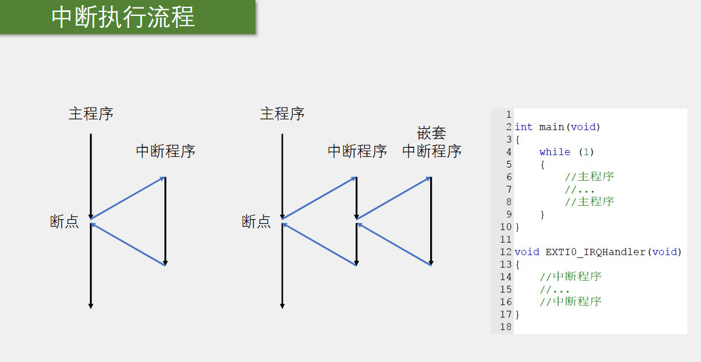

----

### NVIC

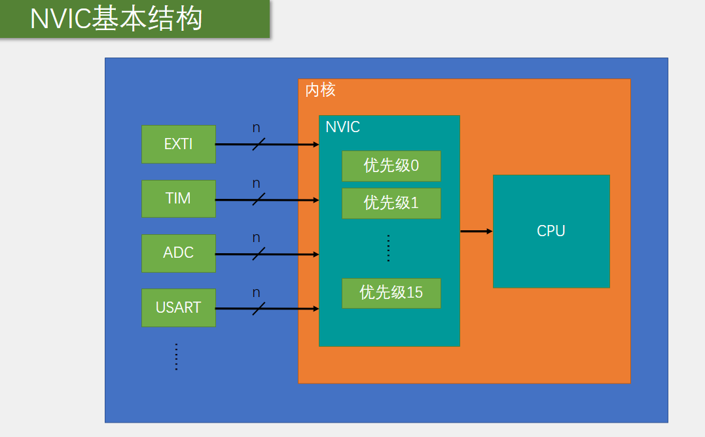

-----

### 中断优先级

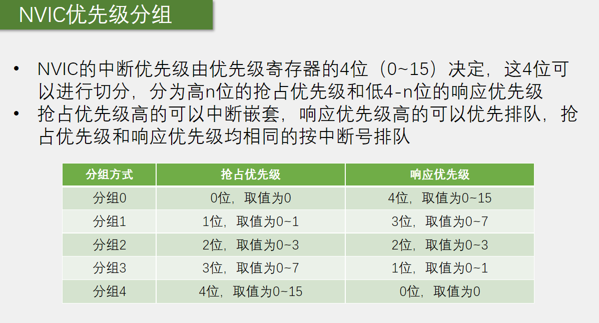

----

### EXTI

**简介**

- Extern Interrupt 外部中断
- EXTI可以监测GPIO口的电平信号，当其指定的GPIO口产生电平变化时，EXTI将立即向NVIC发出中断申请，经过NVIC裁决后即可中断CPU主程序，使CPU执行EXTI对应的中断程序
- 支持的触发方式：上升沿/下降沿/双边沿/软件触发
- 支持的GPIO口：所有GPIO口，但相同的Pin不能同时触发中断
- 通道数：16个GPIO_Pin，外加PVD输出、RTC闹钟、USB唤醒、以太网唤醒
- 触发响应方式：中断响应/事件响应

**基本结构**

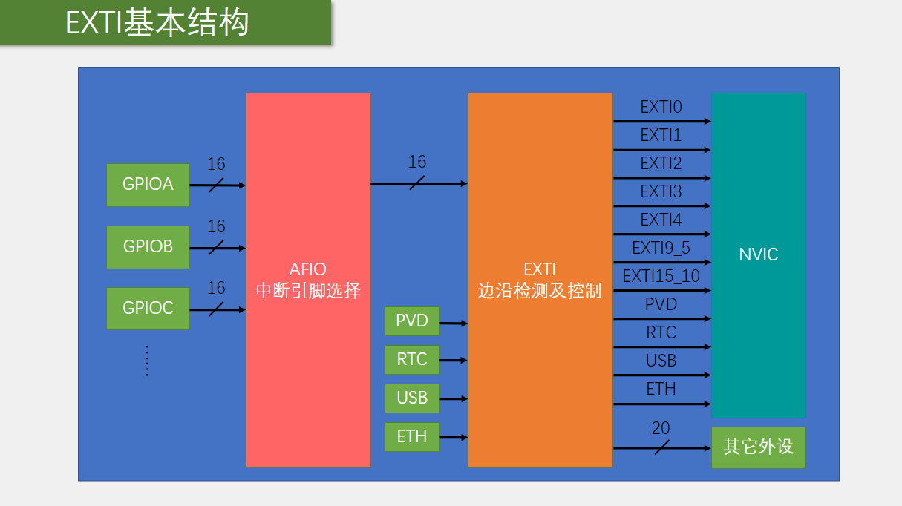

----

### AFIO

- AFIO主要用于引脚复用功能的选择和重定义
- 在STM32中，AFIO主要完成两个任务：复用功能引脚重映射、中断引脚选择

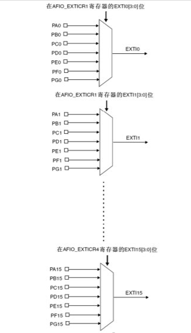


### 对射式红外传感器计次

**代码**

*CountSensor.c*

```c
#include "stm32f10x.h"

uint16_t CountSensor_Count;		//用于在OLED上显示的变量

void CountSensor_Init(void){
	//使能外设时钟
	RCC_APB2PeriphClockCmd(RCC_APB2Periph_GPIOB, ENABLE);
	RCC_APB2PeriphClockCmd(RCC_APB2Periph_AFIO, ENABLE);	//复用IO
	
	//配置GPIO
	GPIO_InitTypeDef GPIO_InitStructure;
	GPIO_InitStructure.GPIO_Mode = GPIO_Mode_IPU;
	GPIO_InitStructure.GPIO_Pin = GPIO_Pin_14;
	GPIO_InitStructure.GPIO_Speed = GPIO_Speed_50MHz;
	GPIO_Init(GPIOB, &GPIO_InitStructure);
    
	//配置EXTI
    GPIO_EXTILineConfig(GPIO_PortSourceGPIOB, GPIO_PinSource14);
    
	EXTI_InitTypeDef EXTI_InitStructure;
	EXTI_InitStructure.EXTI_Line = EXTI_Line14;				//14号口
	EXTI_InitStructure.EXTI_LineCmd = ENABLE;				//开启
	EXTI_InitStructure.EXTI_Mode = EXTI_Mode_Interrupt;		 //中断模式
	EXTI_InitStructure.EXTI_Trigger = EXTI_Trigger_Falling;	 //下降沿触发，遮挡的时候触发
//	EXTI_InitStructure.EXTI_Trigger = EXTI_Trigger_Rising;	//上升沿触发，遮挡后离开触发
//	EXTI_InitStructure.EXTI_Trigger = EXTI_Trigger_Rising_Falling; //上升下降沿都触发，遮挡离开都触发
	
	//初始化EXTI
	EXTI_Init( &EXTI_InitStructure );
	
	//NVIC中断优先级分组
	NVIC_PriorityGroupConfig( NVIC_PriorityGroup_2 );
	
	//配置NVIC
	NVIC_InitTypeDef NVIC_InitStructure;
	NVIC_InitStructure.NVIC_IRQChannel = EXTI15_10_IRQn;		//因为用的是EXTI_Line13，对应的通道应该是14，但是因为5
	NVIC_InitStructure.NVIC_IRQChannelCmd = ENABLE;				//使能通道
	NVIC_InitStructure.NVIC_IRQChannelPreemptionPriority = 1;	 //对应响应优先级下的取值范围
	NVIC_InitStructure.NVIC_IRQChannelSubPriority = 1;			//对应抢占优先级下的取值范围
	
	//初始化NVIC
	NVIC_Init( &NVIC_InitStructure );
}

//用于获取CountSensor_Coun的值
uint16_t CountSensor_Get(void){
	return CountSensor_Count;
}

//中断函数，不需要声明
void EXTI15_10_IRQHandler(void)		//因为中断通道是13所以是 EXTI15_10_IRQHander，参见startup_stm32f10x_md.s的119行
{
	if(EXTI_GetITStatus(EXTI_Line14) == SET)	//因为10~15都会调用这个函数，判断调用的是不是13
	{
		CountSensor_Count++;
		EXTI_ClearITPendingBit(EXTI_Line14);	//清除中断标致位
	}
}

```

*main.c*

```c
#include "stm32f10x.h"                  // Device header
#include "Delay.h"
#include <math.h>
#include "OLED.h"
#include "CountSensor.h"

/*项目思路：传感器被触发->中断函数被调用->计数变量自增->OLED展示数字增减*/

int main(void){
	
	OLED_Init();	//初始化OLED
	
	OLED_ShowString(1,1,"Count:");	
	
	while(1)
	{
		OLED_ShowNum(1,7,CountSensor_Get(), 5);		//
	}	
}
//最后一行要留多加一个空行

```

----

### 旋转编码器计次

*Encoder.c*

**代码**

```c
#include "stm32f10x.h"                  // Device header

int16_t Encoder_Count;

void Encoder_Init(void){

//使能外设时钟
	RCC_APB2PeriphClockCmd(RCC_APB2Periph_GPIOB, ENABLE);
	RCC_APB2PeriphClockCmd(RCC_APB2Periph_AFIO, ENABLE);	//复用IO
	
	//配置GPIO
	GPIO_InitTypeDef GPIO_InitStructure;
	GPIO_InitStructure.GPIO_Mode = GPIO_Mode_IPU;
	GPIO_InitStructure.GPIO_Pin = GPIO_Pin_0 | GPIO_Pin_1;
	GPIO_InitStructure.GPIO_Speed = GPIO_Speed_50MHz;
	GPIO_Init(GPIOB, &GPIO_InitStructure);
	
	GPIO_EXTILineConfig(GPIO_PortSourceGPIOB, GPIO_PinSource0);
	GPIO_EXTILineConfig(GPIO_PortSourceGPIOB, GPIO_PinSource1);

	
	
	//配置EXTI
	EXTI_InitTypeDef EXTI_InitStructure;
	EXTI_InitStructure.EXTI_Line = EXTI_Line0 | EXTI_Line1;	//0号和1号GPIO
	EXTI_InitStructure.EXTI_LineCmd = ENABLE;				//开启
	EXTI_InitStructure.EXTI_Mode = EXTI_Mode_Interrupt;		//中断模式
	EXTI_InitStructure.EXTI_Trigger = EXTI_Trigger_Falling;	//下降沿触发，遮挡的时候触发
//	EXTI_InitStructure.EXTI_Trigger = EXTI_Trigger_Rising;	//上升沿触发，遮挡后离开触发
//	EXTI_InitStructure.EXTI_Trigger = EXTI_Trigger_Rising_Falling; //上升下降沿都触发，遮挡离开都触发

	
	//初始化EXTI
	EXTI_Init( &EXTI_InitStructure );
	
	
	//NVIC中断优先级分组
	NVIC_PriorityGroupConfig( NVIC_PriorityGroup_2 );
	
	//配置NVIC
	NVIC_InitTypeDef NVIC_InitStructure;
	
	//0口
	NVIC_InitStructure.NVIC_IRQChannel = EXTI0_IRQn;	//中断通道列表
	NVIC_InitStructure.NVIC_IRQChannelCmd = ENABLE;			//使能通道
	NVIC_InitStructure.NVIC_IRQChannelPreemptionPriority = 1;	//
	NVIC_InitStructure.NVIC_IRQChannelSubPriority = 1;			//响应优先级
	
	//1口
	NVIC_InitStructure.NVIC_IRQChannel = EXTI1_IRQn;			//中断通道列表
	NVIC_InitStructure.NVIC_IRQChannelCmd = ENABLE;				//使能通道
	NVIC_InitStructure.NVIC_IRQChannelPreemptionPriority = 1;	//
	NVIC_InitStructure.NVIC_IRQChannelSubPriority = 2;			//响应优先级
	
	
	//初始化NVIC
	NVIC_Init( &NVIC_InitStructure );

}


int16_t Encoder_Get(void){
	int16_t Temp;
	Temp = Encoder_Count;
	Encoder_Count = 0;
	return Temp;
}


//0口中断函数
void EXTI0_IRQHandler(void)
{
	if(EXTI_GetITStatus(EXTI_Line0) == SET){
		if(GPIO_ReadInputDataBit(GPIOB, GPIO_Pin_1) == 0){
			Encoder_Count --;
		}
		EXTI_ClearITPendingBit(EXTI_Line0);
	}
}

//1口中断函数
void EXTI1_IRQHandler(void)
{
	if(EXTI_GetITStatus(EXTI_Line1) == SET){
		if(GPIO_ReadInputDataBit(GPIOB, GPIO_Pin_0) == 0){
			Encoder_Count++;
		}
		EXTI_ClearITPendingBit(EXTI_Line1);
	}
}

```

-------

## 定时器

### 简介

> - 定时器可以对输入的时钟进行计数，并在计数值达到设定值时触发中断
> - **16**位**计数器**、**预分频器**、**自动重装寄存器**的时基单元，在72MHz计数时钟下可以实现最大59.65s的定时
> - 不仅具备基本的定时中断功能，而且还包含内外时钟源选择、输入捕获、输出比较、编码器接口、主从触发模式等多种功能
> - 根据复杂度和应用场景分为了**高级定时器**、**通用定时器**、**基本定时器**三种类型
>
> 

### 时基单元

**预分频器**

> 对传入的计数时钟进行分频
> 例：
> 预分频寄存器的值为0， *输出频率  = 输入频率/1 = 72MHz*
> 预分频寄存器的值为1， *输出频率  = 输入频率/2 = 36MHz*
> 预分频寄存器的值为2， *输出频率  = 输入频率/3 = 24MHz*
> ....
> 预分频寄存器的值为65535， *输出频率*......

**计数器**

> 对预分频后的计数时钟进行计数，计数时钟每来一个上升沿/下降沿计数器的值+1 / -1，最大可以计数到+65535 / -65535。
> 当计数器自增运行到**目标值**时，产生中断信号，并清零计数器，开始下一次计数
>
> ```c
> /*
> 	计数器溢出频率 ~= 计时时间
> 	CK_CNT_OV = CK_CNT / (ARR + 1)
> 			  = CK_PSC / (PSC + 1) / (ARR + 1)
> 			  = 72MHz  / [(7200-1)+1] / [(10000 - 1)+1]
> 			  = 72000KHz / 7200 / 10000
> 			  = 10KHz / 10000
> 			  = 10000Hz / 10000
> 			  = 1 (s)
> */
> ```
>

**自动重装寄存器**

> 计数器的目标值

### 定时器类型

|    类型    |          编号          | 总线 |                             功能                             |
| :--------: | :--------------------: | :--: | :----------------------------------------------------------: |
| 高级定时器 |       TIM1、TIM8       | APB2 | 拥有通用定时器全部功能，并额外具有重复计数器、死区生成、互补输出、刹车输入等功能 |
| 通用定时器 | TIM2、TIM3、TIM4、TIM5 | APB1 | 拥有基本定时器全部功能，并额外具有内外时钟源选择、输入捕获、输出比较、编码器接口、主从触发模式等功能 |
| 基本定时器 |       TIM6、TIM7       | APB1 |              拥有定时中断、主模式触发DAC的功能               |

*STM32F103C8T6定时资源：TIM1、TIM2、TIM3、TIM4*

#### 基本定时器

> 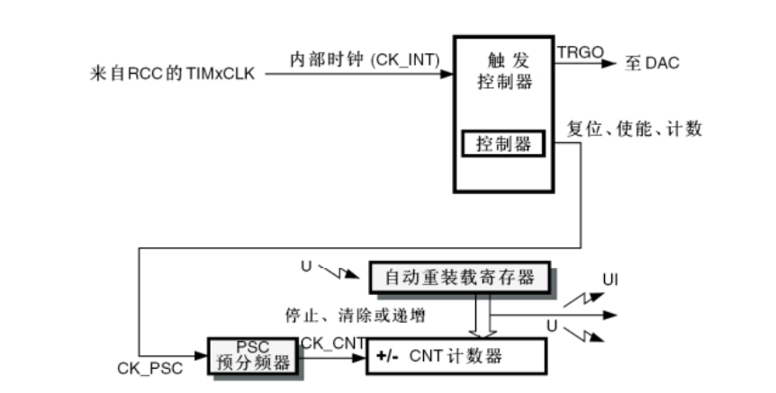
>
> - 基本定时器只能使用系统内部时钟（TIMxCLK）即晶振产生的频率（一般是72MHz）
>   基本定时器的**计数器**只能使用**向上自增**的模式计数，自增到重装值则清零
>
> - *UI：计数值 = 自动重装值  称为：更新中断*    *UI后面连接的是NVIC*
>   *U：更新事件*   *不会触发更新中断，可以触发内部其他电路的工作*

#### 通用定时器

> 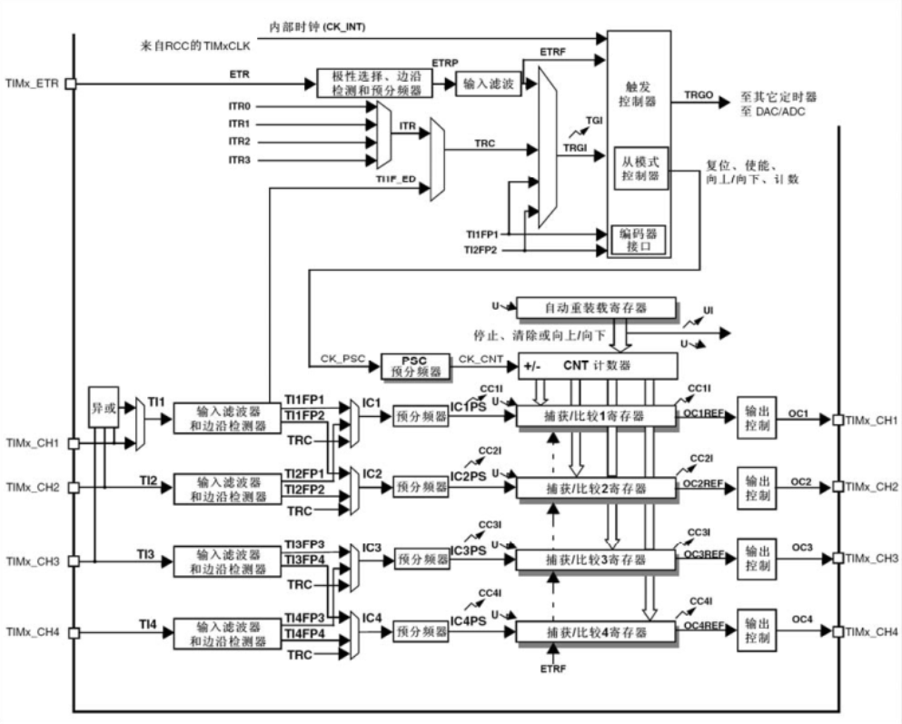
>
> - 通用定时器的计数器支持**向上计数、向下计数、中央对其计数**   /l/l、\l\l、/\/\ 
>
> - 通用定时器可以使用**系统内部时钟**和**外部时钟**(TIMx_ETR)
>
> - 经过配置选择后的信号可以走ETRF（外部触发控制器）和TRGI（触发）两路
>
>   > 信号走 TRGI 可触发定时器的从模式，外部时钟的输入 ----- 外部时钟模式1
>   > 信号走 ETRF 和基本定时器差不多 ----- 外部时钟模式2
>   >
>   > *TRGI这一路可以用于定时器的级联*

#### 高级计时器

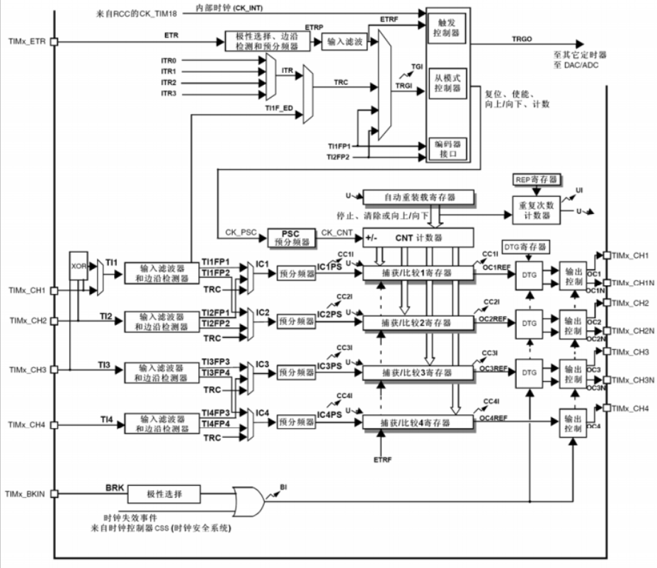

#### 定时中断基本结构

> 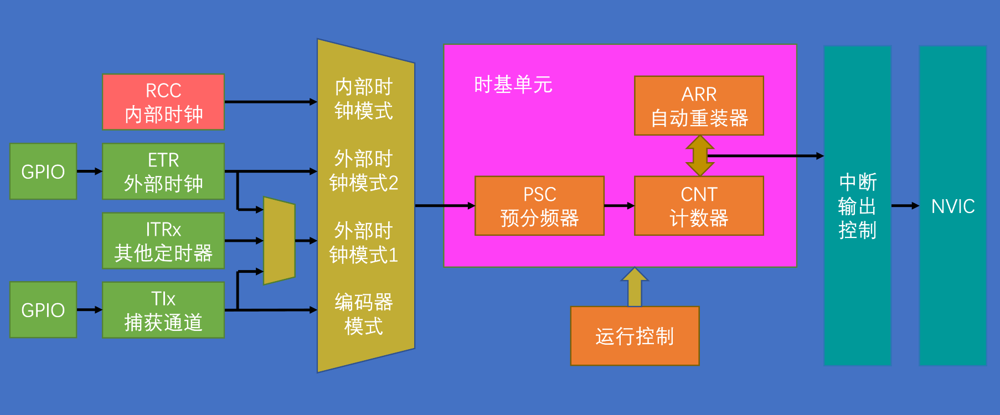
>
> 中断输出控制：用于判断是否需要输出中断

### 内部定时器定时中断

*Timer.c*

```c
#include "stm32f10x.h"                  // Device header

extern uint16_t Num;	//当变量在其他文件定义，需跨文件使用变量时，用extern


void Timer_Init(void){
	RCC_APB1PeriphClockCmd(RCC_APB1Periph_TIM2, ENABLE);	//使能时钟2外设（通用时钟）
	
	TIM_InternalClockConfig(TIM2);	//选择内部时钟，定时器使能后默认使用的是内部时钟，不写也是调用内部时钟
	
	
	//配置时基单元
	TIM_TimeBaseInitTypeDef TIM_TimeBaseInitStruct;
	TIM_TimeBaseInitStruct.TIM_ClockDivision = TIM_CKD_DIV1;	 	//时钟分频，与时基单元关系不大，主要用于过滤信号的抖动干扰
	TIM_TimeBaseInitStruct.TIM_CounterMode = TIM_CounterMode_Up;	//计数器模式，向上计数
	TIM_TimeBaseInitStruct.TIM_Period = 10000 - 1;					//时钟周期，自动重装器的值(ARR)
	TIM_TimeBaseInitStruct.TIM_Prescaler = 7200 - 1;				//预分频器
	TIM_TimeBaseInitStruct.TIM_RepetitionCounter = 0;			 	//重复计数器，高级定时器才有，此处赋值0
	TIM_TimeBaseInit(TIM2, &TIM_TimeBaseInitStruct);				//初始化时基单元
	
	/*
	计数器溢出频率
	CK_CNT_OV = CK_CNT / (ARR + 1)
			  = CK_PSC / (PSC + 1) / (ARR + 1)
			  = 72MHz  / [(7200-1)+1] / [(10000 - 1)+1]
			  = 72000KHz / 7200 / 10000
			  = 10KHz / 10000
			  = 10000Hz / 10000
			  = 1 (s)
	*/
	
	//清除标志位
	TIM_ClearFlag(TIM2, TIM_FLAG_Update);			//手动更新标志位，防止刚初始化就进入中断的情况
	//使能中断
	TIM_ITConfig(TIM2, TIM_IT_Update, ENABLE);
	
	
	//配置NVIC
	NVIC_PriorityGroupConfig( NVIC_PriorityGroup_2 );	//NVIC分组
	
	NVIC_InitTypeDef NVIC_InitStructure;
	NVIC_InitStructure.NVIC_IRQChannel = TIM2_IRQn;				//中断通道，定时器2的NVIC通道		
	NVIC_InitStructure.NVIC_IRQChannelCmd = ENABLE;				//使能中断通道		
	NVIC_InitStructure.NVIC_IRQChannelPreemptionPriority = 2;	//抢占优先级位数
	NVIC_InitStructure.NVIC_IRQChannelSubPriority = 1;			//响应优先级位数
	NVIC_Init( &NVIC_InitStructure );
	
	//启动定时器
	TIM_Cmd(TIM2, ENABLE);
}

//中断函数
void TIM2_IRQHandler(void)	//定时器2的中断函数
{
	if(TIM_GetITStatus(TIM2, TIM_IT_Update) == SET)	//因为是自动重装值所以是更新中断
	{
		Num++;
		TIM_ClearITPendingBit(TIM2, TIM_IT_Update);	//清除中断
	}
}

```

*mian.c*

```c
#include "stm32f10x.h"                  // Device header
#include "Delay.h"
#include <math.h>
#include "OLED.h"
#include "Timer.h"

uint16_t Num;

int main(void){
	
	OLED_Init();
	Timer_Init();
	
	OLED_ShowString(1, 1, "Num:");
	
	while(1){
		OLED_ShowNum(1, 5, Num, 5);
		OLED_ShowNum(2, 5, TIM_GetCounter(TIM2), 5);	//TIM_GetCounter获取计数器的值：0 ~（10000-1）
	}	
}
//最后一行要留多加一个空行

```

----

### 外部定时器定时中断

*Timer.c*

```c
#include "stm32f10x.h"                  // Device header

extern uint16_t Num;	//当变量在其他文件定义，需跨文件使用变量时，用extern


void Timer_Init(void){
	RCC_APB1PeriphClockCmd(RCC_APB1Periph_TIM2, ENABLE);	//使能时钟2外设（通用时钟）
	
//	TIM_InternalClockConfig(TIM2);	//选择内部时钟，定时器使能后默认使用的是内部时钟，不写也是调用内部时钟
	TIM_ETRClockMode2Config(TIM2, TIM_ExtTRGPSC_OFF, TIM_ExtTRGPolarity_NonInverted, 0x00);//外部时钟，模式2，具体参考教程 ⬇
	
	//配置GPIO
	GPIO_InitTypeDef GPIO_InitStructure;
	GPIO_InitStructure.GPIO_Mode = GPIO_Mode_IPU;
	GPIO_InitStructure.GPIO_Pin = GPIO_Pin_0;			//因为GPIO_Pin_0是TIM2寄存器的复用引脚
	GPIO_InitStructure.GPIO_Speed = GPIO_Speed_50MHz;
	GPIO_Init(GPIOA, &GPIO_InitStructure);
	
	//配置时基单元
	TIM_TimeBaseInitTypeDef TIM_TimeBaseInitStruct;
	TIM_TimeBaseInitStruct.TIM_ClockDivision = TIM_CKD_DIV1;	 	//时钟分频
	TIM_TimeBaseInitStruct.TIM_CounterMode = TIM_CounterMode_Up;	//计数器模式，向上计数
	TIM_TimeBaseInitStruct.TIM_Period = 10 - 1;						//时钟周期，自动重装值取10，0~9
	TIM_TimeBaseInitStruct.TIM_Prescaler = 1 - 1;					//预分频器，取0 不需要分频
	TIM_TimeBaseInitStruct.TIM_RepetitionCounter = 0;			 	//重复计数器
	TIM_TimeBaseInit(TIM2, &TIM_TimeBaseInitStruct);				//初始化时基单元
	
	/*
	计数器溢出频率
	CK_CNT_OV = CK_CNT / (ARR + 1)
			  = CK_PSC / (PSC + 1) / (ARR + 1)
			  = 72MHz  / [(1-1)+1] / [(10 - 1)+1]
			  = 72000KHz / 1 / 10
			  = 7200KHz
			  = 7200000HZ
			  = 7200000 (s)
	*/
	
	//清除标志位
	TIM_ClearFlag(TIM2, TIM_FLAG_Update);			//手动更新标志位，防止刚初始化就进入中断的情况
	//使能中断
	TIM_ITConfig(TIM2, TIM_IT_Update, ENABLE);
	
	
	//配置NVIC
	NVIC_PriorityGroupConfig( NVIC_PriorityGroup_2 );			//NVIC分组
	
	NVIC_InitTypeDef NVIC_InitStructure;
	NVIC_InitStructure.NVIC_IRQChannel = TIM2_IRQn;				//中断通道，定时器2的NVIC通道		
	NVIC_InitStructure.NVIC_IRQChannelCmd = ENABLE;				//使能中断通道		
	NVIC_InitStructure.NVIC_IRQChannelPreemptionPriority = 2;	//抢占优先级位数
	NVIC_InitStructure.NVIC_IRQChannelSubPriority = 1;			//响应优先级位数
	NVIC_Init( &NVIC_InitStructure );
	
	//启动定时器
	TIM_Cmd(TIM2, ENABLE);
}

//获取计数器的值
uint16_t Timer_GetCounter(void)
{
	return TIM_GetCounter(TIM2);
}

//中断函数
void TIM2_IRQHandler(void)	//定时器2的中断函数
{
	if(TIM_GetITStatus(TIM2, TIM_IT_Update) == SET)
	{
		Num++;
		TIM_ClearITPendingBit(TIM2, TIM_IT_Update);	//清除中断
	}
}

```

*mian.c*

```c
#include "stm32f10x.h"                  // Device header
#include "Delay.h"
#include <math.h>
#include "OLED.h"
#include "Timer.h"

uint16_t Num;

int main(void){
	OLED_Init();
	Timer_Init();
	
	OLED_ShowString(1, 1, "Num:");
	OLED_ShowString(1, 1, "CNT:");
	while(1){
		OLED_ShowNum(1, 5, Num, 5);
		OLED_ShowNum(2, 5, Timer_GetCounter(), 5);	//TIM_GetCounter获取计数器的值：0 ~（10000-1）
	}	
}
//最后一行要留多加一个空行

```

[原理参考地址](https://www.bilibili.com/video/BV1th411z7sn?p=14&t=1972.2)

### TIM输出比较

> - 输出比较（Output Compare）可以通过比较**CNT**（时基单元中的计数器）与**CCR**（捕获/比较寄存器）寄存器值的关系，来对输出电平进行置1、置0或翻转的操作，**用于输出一定频率和占空比的PWM波形**
> - 每个高级定时器和通用定时器都拥有4个输出比较通道

### PWM

> - PWM（Pulse Width Modulation）脉冲宽度调制
>
> - 在具有惯性的系统中，可以通过对一系列脉冲的宽度进行调制，来等效地获得所需要的模拟参量，常应用于电机控速等领域
>
> - PWM参数：   
>   频率 = 1 / TS
>   占空比 = TON / TS  *高电平时间先当与整个周期时间的比例*
>   分辨率 = 占空比变化步距，[表示调整频率和占空比时的精细程度](https://blog.csdn.net/gdaswater/article/details/6218148)
>   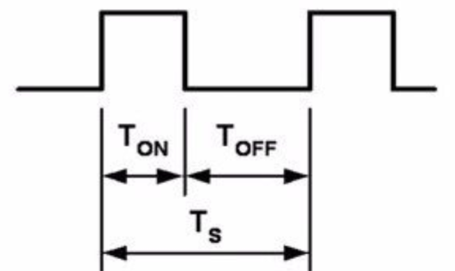
>
> - *PWM相对于飞快的给一个高电平然后又飞快的给一个低电平从而达到：LED灯亮度调节、小车电机变速等惯性系统*
>
> - 基本结构
>   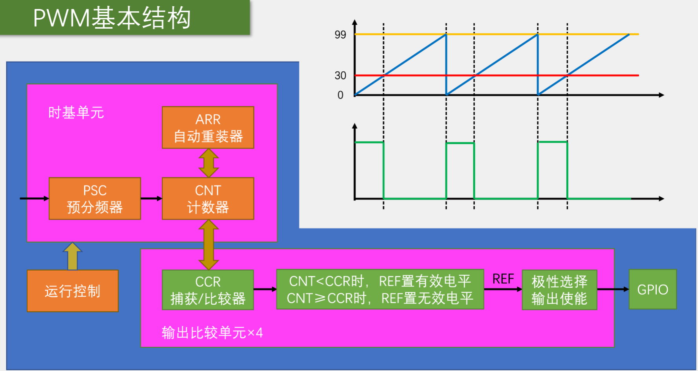
>   *REF是一个频率可调、占空比可调的PWM波形*
>
> - 参数计算
>
>   > - PWM频率：Freq = CK_PSC / (PSC + 1) / (ARR + 1)  *= 计数器溢出频率*
>   > - PWM占空比：Duty = CCR / (ARR + 1)
>   > - PWM分辨率：Reso = 1/(ARR + 1)  

### 输出比较通道

> - 比较CNT与CRR的值选择输出模式
> - 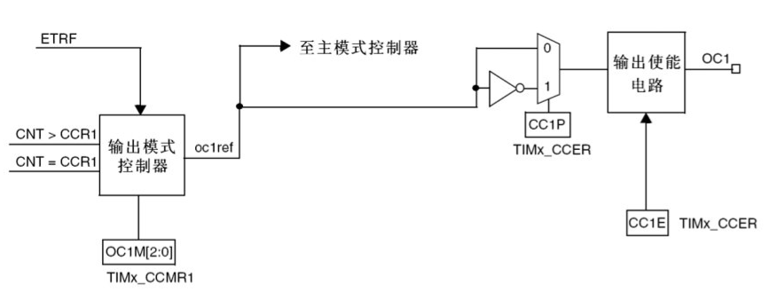
> - 输出比较模式（位于上图输出模式控制器中）
>   

### 输出PWM波步骤

> 1. RCC开启时钟，TIM和GPIO
> 2. 配置时基单元
> 3. 配置输出比较单元（输出比较模式、极性选择、输出使能、CCR的值）
> 4. 配置GPIO

### PWM实现LED呼吸灯

*PWM.c*

```c
#include "stm32f10x.h"                  // Device header

void PWM_Init(void){
	//RCC开启时钟
	RCC_APB1PeriphClockCmd(RCC_APB1Periph_TIM2, ENABLE);	//使能时钟2外设（通用时钟）
	RCC_APB2PeriphClockCmd(RCC_APB2Periph_GPIOA,ENABLE);	//使能GPIOA
	
	/*
	RCC_APB2PeriphClockCmd(RCC_APB2Periph_AFIO,ENABLE);		//使用AFIO引脚重映射
	GPIO_PinRemapConfig(GPIO_PartialRemap1_TIM2, ENABLE);	//重映射定时器2
	GPIO_PinRemapConfig(GPIO_Remap_SWJ_JTAGDisable, ENABLE);//把PA15、PB3、PB4当GPIO口使用
	*/
	
	TIM_InternalClockConfig(TIM2);	//选择内部时钟，定时器使能后默认使用的是内部时钟，不写也是调用内部时钟
	
	//配置时基单元
	TIM_TimeBaseInitTypeDef TIM_TimeBaseInitStruct;
	TIM_TimeBaseInitStruct.TIM_ClockDivision = TIM_CKD_DIV1;	 	//时钟分频，与时基单元关系不大，主要用于过滤信号的抖动干扰
	TIM_TimeBaseInitStruct.TIM_CounterMode = TIM_CounterMode_Up;	//计数器模式，向上计数
	TIM_TimeBaseInitStruct.TIM_Period = 100 - 1;					//自动重装器的值（时钟周期），ARR
	TIM_TimeBaseInitStruct.TIM_Prescaler = 720 - 1;				//预分频器，PSC
	TIM_TimeBaseInitStruct.TIM_RepetitionCounter = 0;			 	//重复计数器，高级定时器才有，此处赋值0
	TIM_TimeBaseInit(TIM2, &TIM_TimeBaseInitStruct);				//初始化时基单元
	
	//配置输出比较单元
	TIM_OCInitTypeDef TIM_OCInitStructure;
	TIM_OCStructInit(&TIM_OCInitStructure);							//用初始化函数给结构体先赋个初始值，防止没有赋值的成员导致程序冲突
	TIM_OCInitStructure.TIM_OCMode = TIM_OCMode_PWM1;				//输出比较的模式，PWM1模式
	TIM_OCInitStructure.TIM_OCPolarity = TIM_OCPolarity_High;		//极性选择，高极性
	TIM_OCInitStructure.TIM_OutputState = TIM_OutputState_Enable;	//输出使能
	TIM_OCInitStructure.TIM_Pulse = 100;							//CRR的值
	TIM_OC1Init(TIM2,&TIM_OCInitStructure);
	
	//配置GPIO
	GPIO_InitTypeDef GPIO_InitStructure;
	GPIO_InitStructure.GPIO_Mode = GPIO_Mode_AF_PP;			//复用推挽输出模式，对应普通的开漏/推挽输出引脚的控制权来自于 输出数据寄存器，要让定时器控制GPIO引脚则需要用 复用开漏/推挽输出
	GPIO_InitStructure.GPIO_Pin = GPIO_Pin_0;			
	GPIO_InitStructure.GPIO_Speed = GPIO_Speed_50MHz;		//输出速度为50MHz
	GPIO_Init(GPIOA, &GPIO_InitStructure);
	GPIO_SetBits(GPIOA, GPIO_Pin_0);//初始化为电平状态（灭）
	
	/*
	PWM频率 = CK_PSC / (PSC + 1) / (ARR + 1) = 72MHz / (PSC +1 ) / (ARR + 1) = 1000Hz
	PWM占空比 = CCR / (ARR + 1) = 50%
	PWM分辨率 = 1/(ARR + 1) = 1%
	得 PSC = 719	ARR = 99
	*/
	//启动定时器
	TIM_Cmd(TIM2, ENABLE);
}

//更改通道CCR值
void PWM_SetCompare1(uint16_t Compare)
{
	TIM_SetCompare1(TIM2, Compare);
}

```

*main.c*

```c
#include "stm32f10x.h"                  // Device header
#include "Delay.h"
#include <math.h>
#include "OLED.h"
#include "PWM.h"

uint8_t i;

int main(void){
	
	OLED_Init();
	PWM_Init();
	while(1)
	{
		//动态更改CCR的值
		for(i = 0; i<=100; i++)
		{
			PWM_SetCompare1(i);			//亮
			Delay_ms(10);
		}
		for(i = 0; i<=100; i++)
		{
			PWM_SetCompare1(100 - i);	//灭
			Delay_ms(10);
		}
	}	
}
//最后一行要留多加一个空行

```

### PWM控制舵机

*Servo.c*

```c
#include "stm32f10x.h"                  // Device header
#include "PWM.h"

void Servo_Init(void){
	PWM_Init();
}

void Servo_SetAngle(float Angle)
{
	PWM_SetCompare2(Angle / 180 * 2000 + 500);
}

```

*main.c*

```c
#include "stm32f10x.h"                  // Device header
#include "Delay.h"
#include <math.h>
#include "OLED.h"
#include "Servo.h"
#include "Key.h"

uint8_t KeyNum;
float Angle;

int main(void){
	
	OLED_Init();
	Servo_Init();
	Servo_SetAngle(90);
	OLED_ShowString(1, 1, "Angle: ");
	while(1)
	{
		KeyNum = Key_Get_Num();
		if(KeyNum == 1)
		{
			Angle += 30;
			if (Angle > 180)
			{
				Angle = 0;
			}
		}
		Servo_SetAngle(Angle);
		OLED_ShowNum(1, 7, Angle, 3);
	}	
}
//最后一行要留多加一个空行

```

### PWM控制直流电机

*Motor.c*

```c
#include "stm32f10x.h"                  // Device header
#include "PWM.h"

void Moto_Init(void){
	//使能外设时钟
	RCC_APB2PeriphClockCmd(RCC_APB2Periph_GPIOA, ENABLE);
	//配置GPIO
	GPIO_InitTypeDef GPIO_InitStructure;
	GPIO_InitStructure.GPIO_Mode = GPIO_Mode_Out_PP;		//推挽输出模式
	GPIO_InitStructure.GPIO_Pin = GPIO_Pin_4 | GPIO_Pin_5;	//4号和5号引脚
	GPIO_InitStructure.GPIO_Speed = GPIO_Speed_50MHz;		//输出速度为50MHz
	GPIO_Init(GPIOA, &GPIO_InitStructure);				   //初始化GPIO
	PWM_Init();

}

//设置电机速度
void Motor_SetSpeed(int8_t Speed){
	if(Speed >= 0){
		GPIO_SetBits(GPIOA, GPIO_Pin_4);
		GPIO_ResetBits(GPIOA, GPIO_Pin_5);
		PWM_SetCompare3(Speed);
	}
	else{
		GPIO_ResetBits(GPIOA, GPIO_Pin_4);
		GPIO_SetBits(GPIOA, GPIO_Pin_5);
		PWM_SetCompare3(-Speed);
	}
}

```

*main.c*

```c
#include "stm32f10x.h"                  // Device header
#include "Delay.h"
#include <math.h>
#include "OLED.h"
#include "Motor.h"
#include "Key.h"

uint8_t KeyNum;
int8_t Speed;

int main(void){
	
	OLED_Init();
	Moto_Init();
	Key_Init();
	OLED_ShowString(1, 1, "Speed: ");
	
	Motor_SetSpeed(50);
	
	while(1)
	{
		KeyNum = Key_Get_Num();
		if(KeyNum == 1){
			Speed += 20;
			if(Speed > 100){
				Speed = -100;
			}
		}
		Motor_SetSpeed(Speed);
		OLED_ShowSignedNum(1, 7, Speed, 3);
	}	
}
//最后一行要留多加一个空行

```


## ADC模数转换器

**简介**

> - Analog-Digital Converter 模拟-数字转换器
> - ADC可以将引脚上连续变化的模拟电压转换为内存中存储的数字变量，建立模拟电路到数字电路的桥梁
> - 12位逐次逼近型ADC，1us转换时间
> - 输入电压范围：0~3.3V，转换结果范围：0~4095
> - 18个输入通道，可测量16个外部和2个内部信号源
> - 规则组和注入组两个转换单元
> - 模拟看门狗自动监测输入电压范围
> - 
> - STM32F103C8T6 ADC资源：ADC1、ADC2，10个外部输入通道
>
> *ADC：模拟信号  一> 数字信号*
> *DAC：数字信号 一> 模拟信号*


### ADC单通道

*AD.c*

```c
#include "stm32f10x.h"                  // Device header

void AD_Init(void){
	
	RCC_APB2PeriphClockCmd(RCC_APB2Periph_ADC1, ENABLE);	//开启ADC1时钟
	RCC_APB2PeriphClockCmd(RCC_APB2Periph_GPIOA, ENABLE);
	
	RCC_ADCCLKConfig(RCC_PCLK2_Div6);						//选择6分频
	
	//配置GPIO
	GPIO_InitTypeDef GPIO_InitStructure;
	GPIO_InitStructure.GPIO_Mode = GPIO_Mode_AIN;			//模拟输入模式，相当于ADC的专属模式
	GPIO_InitStructure.GPIO_Pin = GPIO_Pin_0;				//0号引脚
	GPIO_InitStructure.GPIO_Speed = GPIO_Speed_50MHz;		//输出速度为50MHz
	GPIO_Init(GPIOA, &GPIO_InitStructure);					//初始化GPIO
	
	//配置输入通道
	ADC_RegularChannelConfig(ADC1, ADC_Channel_0, 1, ADC_SampleTime_55Cycles5);		
	
	//配置ADC
	ADC_InitTypeDef ADC_InitStructure;
	ADC_InitStructure.ADC_ContinuousConvMode = DISABLE;					//连续扫描模式，不开启则表示单次
	ADC_InitStructure.ADC_DataAlign = ADC_DataAlign_Right;				//数据对其，右对齐
	ADC_InitStructure.ADC_ExternalTrigConv = ADC_ExternalTrigConv_None;	//外部触发转换选择，不外部触发（此项目用软件触发）
	ADC_InitStructure.ADC_Mode = ADC_Mode_Independent;					//工作模式，独立模式
	ADC_InitStructure.ADC_NbrOfChannel = 1;								//通道数目，
	ADC_InitStructure.ADC_ScanConvMode = DISABLE;						//扫描转换模式
	ADC_Init(ADC1, &ADC_InitStructure);
	
	//开启ADC1
	ADC_Cmd(ADC1,ENABLE);
	
	//对ADC进行校准
	ADC_ResetCalibration(ADC1);			//复位校准
	while (ADC_GetResetCalibrationStatus(ADC1) == SET);//等待复位校准，函数返回复位校准的状态	
	ADC_StartCalibration(ADC1);			//开始校准
	while (ADC_GetCalibrationStatus(ADC1) == SET);		//获取校准状态
	
}

uint16_t AD_GetValue(void){
	ADC_SoftwareStartConvCmd(ADC1,ENABLE);
	while(ADC_GetFlagStatus(ADC1, ADC_FLAG_EOC) == RESET);
	return ADC_GetConversionValue(ADC1);
}

```

*main.c*

```c
#include "stm32f10x.h"                  // Device header
#include "Delay.h"
#include <math.h>
#include "OLED.h"
#include "AD.h"

uint16_t ADValue;
float Volatge;

int main(void){
	
	OLED_Init();
	AD_Init();
	
	OLED_ShowString(1, 1, "ADValue: ");
	OLED_ShowString(2, 1, "Volatge:0.00V");
	
	while(1){
		ADValue = AD_GetValue();
		Volatge = (float)ADValue / 4095* 3.3;
		
		OLED_ShowNum(1, 9, ADValue, 4);
		OLED_ShowNum(2, 9, Volatge, 1);
		OLED_ShowNum(2, 11, (uint16_t)(Volatge * 100) % 100, 2);
		
		Delay_ms(100);
	}	
}
//最后一行要留多加一个空行

```

### ADC多通道

*AD.c*

```c
#include "stm32f10x.h"                  // Device header

void AD_Init(void){
	
	RCC_APB2PeriphClockCmd(RCC_APB2Periph_ADC1, ENABLE);	//开启ADC1时钟
	RCC_APB2PeriphClockCmd(RCC_APB2Periph_GPIOA, ENABLE);
	
	RCC_ADCCLKConfig(RCC_PCLK2_Div6);		//选择6分频
	
	//配置GPIO
	GPIO_InitTypeDef GPIO_InitStructure;
	GPIO_InitStructure.GPIO_Mode = GPIO_Mode_AIN;			//模拟输入模式，相当于ADC的专属模式
	GPIO_InitStructure.GPIO_Pin = GPIO_Pin_0 | GPIO_Pin_1 | GPIO_Pin_2 | GPIO_Pin_3;				//0号引脚
	GPIO_InitStructure.GPIO_Speed = GPIO_Speed_50MHz;		//输出速度为50MHz
	GPIO_Init(GPIOA, &GPIO_InitStructure);					//初始化GPIO
	
	//配置ADC
	ADC_InitTypeDef ADC_InitStructure;
	ADC_InitStructure.ADC_ContinuousConvMode = DISABLE;					//连续扫描模式，不开启则表示单次
	ADC_InitStructure.ADC_DataAlign = ADC_DataAlign_Right;				//数据对其，右对齐
	ADC_InitStructure.ADC_ExternalTrigConv = ADC_ExternalTrigConv_None;	//外部触发转换选择，不外部触发（此项目用软件触发）
	ADC_InitStructure.ADC_Mode = ADC_Mode_Independent;					//工作模式，独立模式
	ADC_InitStructure.ADC_NbrOfChannel = 1;								//通道数目，
	ADC_InitStructure.ADC_ScanConvMode = DISABLE;						//扫描转换模式
	ADC_Init(ADC1, &ADC_InitStructure);
	
	//开启ADC1
	ADC_Cmd(ADC1,ENABLE);
	
	//对ADC进行校准
	ADC_ResetCalibration(ADC1);			//复位校准
	while (ADC_GetResetCalibrationStatus(ADC1) == SET);//等待复位校准，函数返回复位校准的状态	
	ADC_StartCalibration(ADC1);			//开始校准
	while (ADC_GetCalibrationStatus(ADC1) == SET);		//获取校准状态
	
}

uint16_t AD_GetValue(uint8_t ADC_Channel){
	//配置输入通道
	ADC_RegularChannelConfig(ADC1, ADC_Channel, 1, ADC_SampleTime_55Cycles5);		
	ADC_SoftwareStartConvCmd(ADC1,ENABLE);
	while(ADC_GetFlagStatus(ADC1, ADC_FLAG_EOC) == RESET);
	return ADC_GetConversionValue(ADC1);
}

```

*mian.c*

```c
#include "stm32f10x.h"                  				// Device header
#include "Delay.h"
#include <math.h>
#include "OLED.h"
#include "AD.h"

uint16_t AD0, AD1, AD2, AD3;

int main(void){
	
	OLED_Init();
	AD_Init();
	
	OLED_ShowString(1, 1, "AD0: ");
	OLED_ShowString(2, 1, "AD1: ");
	OLED_ShowString(3, 1, "AD2: ");
	OLED_ShowString(4, 1, "AD3: ");
	
	while(1){
		AD0 = AD_GetValue(ADC_Channel_0);
		AD1 = AD_GetValue(ADC_Channel_1);
		AD2 = AD_GetValue(ADC_Channel_2);
		AD3 = AD_GetValue(ADC_Channel_3);
		
		OLED_ShowNum(1, 5, AD0, 4);
		OLED_ShowNum(2, 5, AD1, 4);
		OLED_ShowNum(3, 5, AD2, 4);
		OLED_ShowNum(4, 5, AD3, 4);
		
		Delay_ms(100);
	}	
}
//最后一行要留多加一个空行

```


## 附录

### 电路知识储备

**什么是VCC？**

> Vcc，是Volt Current Condenser的简写，意思是电路的**供电电压**，电源电压（双极器件）；电源电压（74系列数字电路）；声控载波（Voice Controlled Carrier)；火线。

**什么是GND？**

> GND是电线**接地端**的简写。代表地线或0线。这个地并不是真正意义上的地，是出于应用而假设的一个地，对于电源来说，它就是一个电源的负极。
>
> GND分为数字地（DGND）模拟地（AGND）

**什么是电平**

> 所谓电平，是指两功率或**电压之比**的对数，有时也可用来表示两**电流之比**的对数。

----

### C语言

**原码补码反码**

- 原码：数据的二进制形式
- 补码：计算机数据的存储形式
- 反码：原码求补码或者由补码求原码的过渡码

**例  **123原码：0111 1011
无符号数：反码 == 原码 == 补码
				123原码：0111 1011
				123反码：0111 1011
				123补码：0111 1011
有符号数：
		正数：反码 == 原码 == 补码
				+123原码：0111 1011
				+123反码：0111 1011
				+123补码：0111 1011
		负数：反码 == 原码符号位不变，其他位按位取反
				   补码 == 反码 +1
				-123原码：1111 1011
				-123反码：1000 0100
				-123补码：1000 0101

**两数相加/减原理**

*原码 + 补码*

- 相加

  > ```c
  > 10 + 6 = 16
  >     0000 1010
  > +   0000 0110
  > --------------
  >     0001 0000
  > ```

- 相减

  > ```c
  > 10 - 6 = 4  -->  10 + (-6) = 4
  >     0000 1010
  > +   1111 1010 		(反码+1  1111 1001 + 1)
  > --------------
  >     0000 0100
  > ```
  >
  > 

**枚举类型enum**


```c
enum { NUM1 =1,CHAR = 's'} Ty;	//定义一个枚举类型的变量 Ty
Ty = NUM1;	//该变量只可以去定义好的内容
printf(" %d", Ty);
```

**代码**

```c
#include <stdio.h>

//通过修改变量类型名使用 enum
typedef enum {
    NUM1 =1,
    CHAR = 's'
} Ty;

int main() {
    Ty k,l;
    k = NUM1;
    l = CHAR;
    printf("%d, %d",k,l);

    return 0;
}

```

---

**#ifndef**

头件的中的#ifndef，这是一个很关键的东西。比如你有两个C文件，这两个C文件都include了同一个头文件。而编译时，这两个C文件要一同编译成一个可运行文件，于是问题来了，大量的声明冲突。

**代码**

*LightSensor.h*

```c
#ifndef _LIGHT_SENSOR_H
#define _LIGHT_SENSOR_H

void LightSensor_Init(void);

#endif

```

