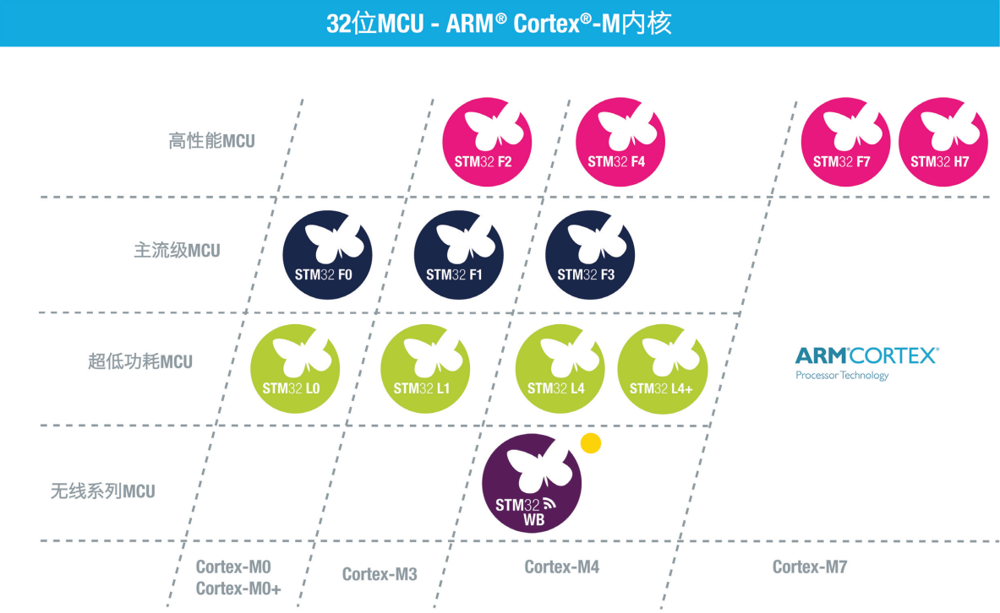
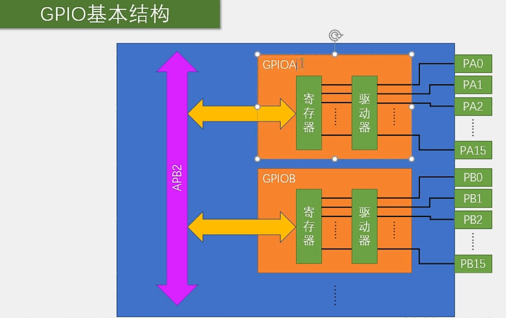

#  STM32

## 简介

- STM32系列是由意法半导体公司推出的ARM Cortex-M内核单片机，从字面上来看，ST为意法半导体公司的缩写，M是Microcontrollers即单片机的缩写，32代表32位

-----

### 芯片系列

- 
- 

----

### 命名规则

- 

-----

### 使用的芯片

***STM32F103C8T6***

- 系列：主流系列STM32 F1
- 内核：ARM Cortex-M3
- 主频：72 MHz
- RAM（随机存取存储器，运行内存）：20 K (SRAM)
- ROM（程序存储器）：64 K (Flash)
- 供电：2.0-3.6V(标准3.3V)
- 封装：LQFP48 （指的是芯片有48个引脚）

----

### 外设资源

- 

----

### 启动配置

- 

----

## GPIO

- 

- **GPIO操作步骤**               **重要   !!!!!**

  > 1. 使用RCC开启GPIO的时钟
  > 2. 使用GPIO_Init函数初始化GPIO
  > 3. 使用输出或者输入控制GPIO口

----

### LED灯闪烁

**库函数：RCC_APB2PeriphClockCmd()**

```C
RCC_APB2PeriphClockCmd( RCC_APB2Periph_GPIOA, ENABLE );
```

**功能**

- 使能外设时钟

**原型**

```c++
void RCC_APB2PeriphClockCmd（uint32_t RCC_APB2Periph, FunctionalState NewState）
```

**参数**

1. 选外设端口。例如，用PA0口，则选用RCC_APB2Periph_GPIOA；用PB0口，则选用RCC_APB2Periph_GPIOB；
2. 选enable or disable。

**GPIO的8种工作模式**

```c
typedef enum
{ GPIO_Mode_AIN = 0x0,			//模拟输入
  GPIO_Mode_IN_FLOATING = 0x04,	 //浮空输入
  GPIO_Mode_IPD = 0x28,			//下拉输入
  GPIO_Mode_IPU = 0x48,			//上拉输入
  GPIO_Mode_Out_OD = 0x14,		//开漏输出
  GPIO_Mode_Out_PP = 0x10,		//推挽输出，该模式下高低电平均有驱动能力
  GPIO_Mode_AF_OD = 0x1C,		//复用开漏
  GPIO_Mode_AF_PP = 0x18		//复用推挽
}GPIOMode_TypeDef;
```

**代码**

```c
#include "stm32f10x.h"                  // Device header
#include "Delay.h"

int main(void){
	//使能外设时钟
	RCC_APB2PeriphClockCmd(RCC_APB2Periph_GPIOA, ENABLE);
	
	//配置GPIO初始化所需要用的一些信息
	GPIO_InitTypeDef GPIO_InitStructure;
	GPIO_InitStructure.GPIO_Mode = GPIO_Mode_Out_PP;	//工作模式为推挽输出，该模式下高低电平均有驱动能力
	GPIO_InitStructure.GPIO_Pin = GPIO_Pin_0;			//用的是GPIO外设的0号引脚
	GPIO_InitStructure.GPIO_Speed = GPIO_Speed_50MHz;	//输出速度为50MHz
	
	//初始化GPIO
	GPIO_Init(GPIOA, &GPIO_InitStructure);
	
	//拉低PA0号引脚输出电平
//	GPIO_ResetBits(GPIOA, GPIO_Pin_0);	//点灯
	//拉高PA0号引脚输出电平
//	GPIO_SetBits(GPIOA, GPIO_Pin_0);	//熄灭
	
	while(1)
	{
		//对指定端口的电平拉高或者拉低，可以操作多个端口，实现效果和GPIO_ResetBits/GPIO_SetBits一样
		GPIO_WriteBit(GPIOA, GPIO_Pin_0, Bit_RESET);	//点灯
		Delay_ms(500);
		GPIO_WriteBit(GPIOA, GPIO_Pin_0, Bit_SET);		//熄灭
		Delay_ms(500);
		/*
		//也可以这样写：
		GPIO_WriteBit(GPIOA, GPIO_Pin_0, 0);			//报错或警告就将0改为:(BitAction)0
		GPIO_WriteBit(GPIOA, GPIO_Pin_0, (BitAction)1);	//强制类型转换
		*/
	}
}
//最后一行要留多加一个空行

```

-----

### LED流水灯

**代码**

```c
#include "stm32f10x.h"                  // Device header
#include "Delay.h"

int main(void){
	//使能外设时钟
	RCC_APB2PeriphClockCmd(RCC_APB2Periph_GPIOA, ENABLE);
	
	//配置GPIO初始化所需要用的一些信息
	GPIO_InitTypeDef GPIO_InitStructure;
	GPIO_InitStructure.GPIO_Mode = GPIO_Mode_Out_PP;	//工作模式为推挽输出，该模式下高低电平均有驱动能力
    GPIO_InitStructure.GPIO_Pin = GPIO_Pin_All;			//初始化0~15个端口
	GPIO_InitStructure.GPIO_Speed = GPIO_Speed_50MHz;	//输出速度为50MHz
	
	//初始化GPIO
	GPIO_Init(GPIOA, &GPIO_InitStructure);
	
	while(1)
	{
        // 通过内存地址的方式修改电平，0x0001是十六进制码，前面加~是因为低电平点亮，所以要取反
        GPIO_Write(GPIOA, ~0x0001);		//0000 0000 0000 0001	1	对应的引脚地址
        Delay_ms(100);
        GPIO_Write(GPIOA, ~0x0002);		//0000 0000 0000 0010	2
        Delay_ms(100);
        GPIO_Write(GPIOA, ~0x0004);		//0000 0000 0000 0100	4
        Delay_ms(100);
        GPIO_Write(GPIOA, ~0x0008);		//0000 0000 0000 1000	8
        Delay_ms(100);
        GPIO_Write(GPIOA, ~0x00010);	//0000 0000 0001 0000	16
        Delay_ms(100);
        GPIO_Write(GPIOA, ~0x00020);	//0000 0000 0010 0000	32
        Delay_ms(100);
        GPIO_Write(GPIOA, ~0x00040);	//0000 0000 0100 0000	64
        Delay_ms(100);
        GPIO_Write(GPIOA, ~0x00080);	//0000 0000 1000 0000	128
        Delay_ms(100);
	}
}
//最后一行要留多加一个空行

```

*补充：初始化多个引脚口时可以通过异或来初始化*

```c
GPIO_InitStructure.GPIO_Pin = GPIO_Pin_0 | GPIO_Pin_1 | GPIO_Pin_2;
```

*使用 for() 优化后*

**代码**

```c
#include "stm32f10x.h"                  // Device header
#include "Delay.h"
#include <math.h>

int main(void){
	//使能外设时钟
	RCC_APB2PeriphClockCmd(RCC_APB2Periph_GPIOA, ENABLE);
	
	//配置GPIO初始化所需要用的一些信息
	GPIO_InitTypeDef GPIO_InitStructure;
	GPIO_InitStructure.GPIO_Mode = GPIO_Mode_Out_PP;	//工作模式为推挽输出，该模式下高低电平均有驱动能力
    GPIO_InitStructure.GPIO_Pin = GPIO_Pin_All;			//初始化0~15个端口
	GPIO_InitStructure.GPIO_Speed = GPIO_Speed_50MHz;	//输出速度为50MHz
	
	//初始化GPIO
	GPIO_Init(GPIOA, &GPIO_InitStructure);
	
    //用uint16_t类型数组存8个引脚地址
	uint16_t Pins[8];	//uint16_t是unsigned short int类型的别名，此处可以直接理解成16进制类型
	for(int i=0; i<8; i++){
		Pins[i]= (uint16_t)(pow(2,i));	//通过强转类型将10进制转为16进制存到数组中
	}
	
	int i;
	while(1){
		i = 0;
		while(i<8){
			GPIO_Write(GPIOA, Pins[i]);
			i++;
			Delay_ms(100);
		}
	}
}
//最后一行要留多加一个空行

```

----

### 蜂鸣器

**代码**

```c
#include "stm32f10x.h"                  // Device header
#include "Delay.h"

int main(void){
	//使能外设时钟
	RCC_APB2PeriphClockCmd(RCC_APB2Periph_GPIOB, ENABLE);
	
	//配置GPIO初始化所需要用的一些信息
	GPIO_InitTypeDef GPIO_InitStructure;
	GPIO_InitStructure.GPIO_Mode = GPIO_Mode_Out_PP;	//工作模式为推挽输出，该模式下高低电平均有驱动能力
    GPIO_InitStructure.GPIO_Pin = GPIO_Pin_12;			//初始化0~15个端口
	GPIO_InitStructure.GPIO_Speed = GPIO_Speed_50MHz;	//输出速度为50MHz
	
	//初始化GPIO
	GPIO_Init(GPIOB, &GPIO_InitStructure);
	
	while(1)
	{
		GPIO_ResetBits(GPIOB, GPIO_Pin_12);	//响
		Delay_ms(500);
		GPIO_SetBits(GPIOB, GPIO_Pin_12);	//停
		Delay_ms(500);
	}
}
//最后一行要留多加一个空行

```

---

### 按键控制LED

**代码**

*LED.c*

```c
#include "stm32f10x.h"                  // Device header

void LED_Init(void){
	//使能外设时钟
	RCC_APB2PeriphClockCmd(RCC_APB2Periph_GPIOA,ENABLE);
	
	//定义GPIO初始化所需要的一些配置
	GPIO_InitTypeDef GPIO_InitStructure;
	GPIO_InitStructure.GPIO_Mode = GPIO_Mode_Out_PP;		//推挽输出模式
	GPIO_InitStructure.GPIO_Pin = GPIO_Pin_1 | GPIO_Pin_2;	//1号和2号引脚
	GPIO_InitStructure.GPIO_Speed = GPIO_Speed_50MHz;		//输出速度为50MHz
	
	//初始化GPIO，默认初始化的是低电平（GPIO_ResetBits）
	GPIO_Init(GPIOA, &GPIO_InitStructure);
}

//打开LED1
void LED1_ON(void){
	GPIO_ResetBits(GPIOA,GPIO_Pin_1);
}

//关闭LED1
void LED1_OFF(void){
	GPIO_SetBits(GPIOA,GPIO_Pin_1);
}

//LED1的状态取反
void LED1_Turn(void){
	if(GPIO_ReadOutputDataBit(GPIOA,GPIO_Pin_1) == 0){	//获取输出寄存器GPIO_Pin_1地址的值
		GPIO_SetBits(GPIOA, GPIO_Pin_1);	
	}
	else{
		GPIO_ResetBits(GPIOA, GPIO_Pin_1);	
	}
}

//打开LED2
void LED2_ON(void){
	GPIO_ResetBits(GPIOA,GPIO_Pin_2);
}

//关闭LED2
void LED2_OFF(void){
	GPIO_SetBits(GPIOA,GPIO_Pin_2);
}

//LED2的状态取反
void LED2_Turn(void){
	if(GPIO_ReadOutputDataBit(GPIOA,GPIO_Pin_2) == 0){	//获取输出寄存器GPIO_Pin_2地址的值
		GPIO_SetBits(GPIOA, GPIO_Pin_2);
	}
	else{
		GPIO_ResetBits(GPIOA, GPIO_Pin_2);
	}
}

```

*Key.c*

```c
#include "stm32f10x.h"                  // Device header
#include "Delay.h"

//初始化按键
void Key_Init(void){
	//使能APB2外设时钟
	RCC_APB2PeriphClockCmd(RCC_APB2Periph_GPIOB, ENABLE);
	
	//配置GPIO
	GPIO_InitTypeDef GPIO_InitStructure;
	GPIO_InitStructure.GPIO_Mode = GPIO_Mode_IPU;		   //上拉输入模式
	GPIO_InitStructure.GPIO_Pin = GPIO_Pin_1 | GPIO_Pin_11;	//也可以 = 0x0001 | 0x0800
	GPIO_InitStructure.GPIO_Speed = GPIO_Speed_50MHz;
	
	//初始化GPIO
	GPIO_Init(GPIOB, &GPIO_InitStructure);
}

//获取按下的按键的引脚地址
uint8_t Key_Get_Num(void){
	uint8_t KeyNum = 0;
	if(GPIO_ReadInputDataBit(GPIOB, GPIO_Pin_1) == 0){
		Delay_ms(20);		//这个延时是为了避免机械式按键的抖动现象
		while(GPIO_ReadInputDataBit(GPIOB, GPIO_Pin_1) == 0){	//用于长按按键的情况
			Delay_ms(20);	//这个延时是为了避免机械式按键的抖动现象
			KeyNum = 1;
		}
	}
	else if(GPIO_ReadInputDataBit(GPIOB, GPIO_Pin_11) == 0){
		Delay_ms(20);		
		while(GPIO_ReadInputDataBit(GPIOB, GPIO_Pin_11) == 0){
			Delay_ms(20);	
			KeyNum = 2;
		}
	}
	return KeyNum;
}

```

*main.c*

```c
#include "stm32f10x.h"                  // Device header
#include "Delay.h"
#include "LED.h"
#include "Key.h"

uint8_t KeyNum;

int main(void){
	LED_Init();		//初始化LED
	Key_Init();		//初始化按键
	while(1)
	{
		KeyNum = Key_Get_Num();	//获取按下的按键
		if (KeyNum == 1){
			LED1_Turn();	//LED状态取反，亮->灭 / 灭->亮
		}else if (KeyNum == 2){
			LED2_Turn();
		}
	}
}
//最后一行要留多加一个空行

```

----

### 光敏传感器控制蜂鸣器

*Buzzer.c*

```c
#include "stm32f10x.h"                  // Device header

//初始化蜂鸣器
void Buzzer_Init(void){
	RCC_APB2PeriphClockCmd(RCC_APB2Periph_GPIOB, ENABLE);
	
	GPIO_InitTypeDef GPIO_InitStructure;
	GPIO_InitStructure.GPIO_Mode = GPIO_Mode_Out_PP;
	GPIO_InitStructure.GPIO_Pin = GPIO_Pin_12;
	GPIO_InitStructure.GPIO_Speed = GPIO_Speed_50MHz;
	GPIO_Init(GPIOB, &GPIO_InitStructure);
	
	GPIO_SetBits(GPIOB, GPIO_Pin_12);
}

//打开蜂鸣器
void Buzzer_ON(void){
	GPIO_ResetBits(GPIOB, GPIO_Pin_12);
}

//关闭蜂鸣器
void Buzzer_OFF(void){
	GPIO_SetBits(GPIOB, GPIO_Pin_12);
}

//蜂鸣器状态取反
void Buzzer_Turn(void){
	if(GPIO_ReadOutputDataBit(GPIOB, GPIO_Pin_12) == 0){
		GPIO_SetBits(GPIOB, GPIO_Pin_12);
	}
	else{	
		GPIO_ResetBits(GPIOB, GPIO_Pin_12);
	}
}

```

*LightSensor.c*

```c
#include "stm32f10x.h"                  // Device header

void LightSensor_Init(void)
{
	RCC_APB2PeriphClockCmd(RCC_APB2Periph_GPIOB, ENABLE);
	
	GPIO_InitTypeDef GPIO_InitStructure;
	GPIO_InitStructure.GPIO_Mode = GPIO_Mode_IPU;
	GPIO_InitStructure.GPIO_Pin = GPIO_Pin_13;
	GPIO_InitStructure.GPIO_Speed = GPIO_Speed_50MHz;
	GPIO_Init(GPIOB, &GPIO_InitStructure);
}

uint8_t LightSensor_Get(void)
{
	return GPIO_ReadInputDataBit(GPIOB, GPIO_Pin_13);
}

```

*main.c*

```c
#include "stm32f10x.h"                  // Device header
#include "Delay.h"
#include "Buzzer.h"
#include "LightSensor.h"

int main(void)
{
	Buzzer_Init();
	LightSensor_Init();
	
	while (1)
	{
		if (LightSensor_Get() == 1)
		{
			Buzzer_ON();
		}
		else
		{
			Buzzer_OFF();
		}
	}
}

```

----


### GPIO库函数

- **GPIO_Init()**

  > **原型**
  >
  > ```c
  > void GPIO_Init (GPIO_TypeDef* GPIOx, GPIO_InitTypeDef* GPIO_InitStruct);
  > ```
  >
  > **参数**
  >
  > 1. GPIO的类型，A口、B口、C口
  > 2. GPIO的配置，如工作模式、端口、输出速度等。需要先在一个  *GPIO_InitTypeDef*  类型的变量中定义好。
  >
  > **功能**
  >
  > 初始化GPIO
  
  


## 附录

### 电路知识储备

**什么是VCC？**

> Vcc，是Volt Current Condenser的简写，意思是电路的**供电电压**，电源电压（双极器件）；电源电压（74系列数字电路）；声控载波（Voice Controlled Carrier)；火线。

**什么是GND？**

> GND是电线**接地端**的简写。代表地线或0线。这个地并不是真正意义上的地，是出于应用而假设的一个地，对于电源来说，它就是一个电源的负极。
>
> GND分为数字地（DGND）模拟地（AGND）

**什么是电平**

> 所谓电平，是指两功率或**电压之比**的对数，有时也可用来表示两**电流之比**的对数。

----

### C语言

**枚举类型enum**


```c
enum { NUM1 =1,CHAR = 's'} Ty;	//定义一个枚举类型的变量 Ty
Ty = NUM1;	//该变量只可以去定义好的内容
printf(" %d", Ty);
```

**代码**

```c
#include <stdio.h>

//通过修改变量类型名使用 enum
typedef enum {
    NUM1 =1,
    CHAR = 's'
} Ty;

int main() {
    Ty k,l;
    k = NUM1;
    l = CHAR;
    printf("%d, %d",k,l);

    return 0;
}

```